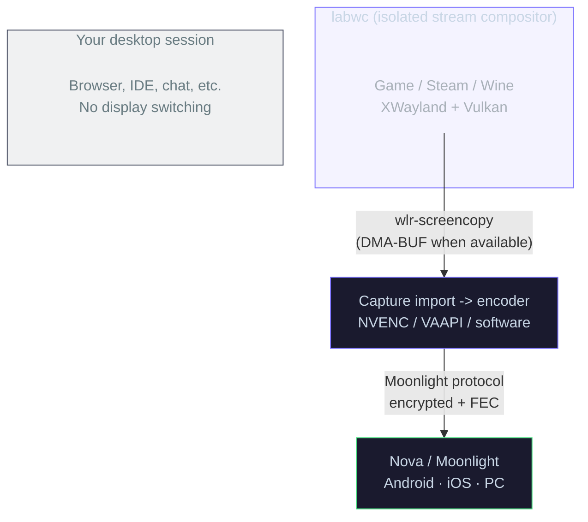

<div align="center">


# Polaris

**Self-hosted game streaming for Linux.**

Stream your PC games to Moonlight clients without wrecking your desktop layout.
Polaris combines an isolated compositor runtime, GPU-aware capture, a modern web UI, and clear runtime telemetry so you can see what the host is actually doing.

[](https://github.com/papi-ux/polaris/stargazers)
[](LICENSE)
[](https://github.com/papi-ux/polaris/releases/latest)

[Quick Start](#quick-start) · [Install](#install) · [Compatibility](#compatibility) · [Known Limitations](#known-limitations) · [Roadmap](ROADMAP.md) · [Why Polaris](#why-polaris) · [Use with Nova](#use-with-nova) · [How It Works](#how-it-works) · [Configuration](#configuration) · [Client Apps](#client-apps) · [Security](SECURITY.md) · [Changelog](docs/changelog.md) · [FAQ](#faq)

**Support**: [Issues](https://github.com/papi-ux/polaris/issues) · [Discussions](https://github.com/papi-ux/polaris/discussions)

<br/>

<picture>
  <source media="(prefers-color-scheme: light)" srcset="docs/screenshots/polaris-showcase.gif" width="820" />
  <source media="(prefers-color-scheme: dark)" srcset="docs/screenshots/polaris-showcase-oled.gif" width="820" />
  
</picture>

</div>

> [!IMPORTANT]
> Polaris is a Linux host today. Fedora 42, Fedora 43, and Arch Linux have direct `v1.0.2` release packages. Bazzite can use the Fedora RPM through `rpm-ostree`, but that path is still experimental while real-hardware validation continues. Ubuntu 24.04 DEB packaging is staged for the next tagged release; Debian-family distros remain source-build oriented until that asset is published.

> [!NOTE]
> `v1.0.2` is the current public Polaris release line. The host, web console, Fedora RPM, and Arch package are ready for broader testing, but this is still an early public surface. Expect some distro, GPU, and client edge cases while compatibility keeps expanding.

## Quick Start

### Fastest install: Fedora 42/43 RPM

```bash
fedora_version="$(rpm -E %fedora)"
wget "https://github.com/papi-ux/polaris/releases/latest/download/Polaris-fedora${fedora_version}-x86_64.rpm"
sudo dnf install "./Polaris-fedora${fedora_version}-x86_64.rpm"
sudo polaris --setup-host
polaris
```

Open **https://localhost:47990**, create your web UI password, and pair a client.

### Fastest install: Arch package

```bash
wget https://github.com/papi-ux/polaris/releases/latest/download/Polaris-arch-x86_64.pkg.tar.zst
sudo pacman -U ./Polaris-arch-x86_64.pkg.tar.zst
sudo polaris --setup-host
polaris
```

### Experimental install: Bazzite

```bash
fedora_version="$(rpm -E %fedora)"
wget "https://github.com/papi-ux/polaris/releases/latest/download/Polaris-fedora${fedora_version}-x86_64.rpm"
sudo rpm-ostree install "./Polaris-fedora${fedora_version}-x86_64.rpm"
systemctl reboot

# After reboot:
sudo polaris --setup-host
polaris
```

Bazzite is Fedora-based but immutable, so Polaris is installed as a layered RPM and requires a reboot before the command is available. See the [Bazzite install guide](docs/bazzite.md) for caveats, rollback, and validation notes.

### Upcoming install: Ubuntu 24.04 DEB

```bash
wget https://github.com/papi-ux/polaris/releases/latest/download/Polaris-ubuntu24.04-x86_64.deb
sudo apt install ./Polaris-ubuntu24.04-x86_64.deb
sudo polaris --setup-host
polaris
```

The Ubuntu DEB asset is staged for the next tagged release. Until that release exists, use the source build path below. See the [Ubuntu install guide](docs/ubuntu.md) for package status, source build fallback, and validation notes.

### Source build: Debian, dev machines, or custom setups

```bash
git clone --recursive https://github.com/papi-ux/polaris.git
cd polaris
cmake -B build -DCMAKE_BUILD_TYPE=Release -DPOLARIS_ENABLE_CUDA=ON
cmake --build build -j$(nproc)
sudo cmake --install build
sudo polaris --setup-host
polaris
```

### First stream checklist

1. Open the Polaris web UI at **https://localhost:47990**.
2. Confirm the recommended Linux path:
   - `headless_mode = enabled`
   - `linux_use_cage_compositor = true`
   - `linux_prefer_gpu_native_capture = enabled`
3. Pair a client:
   - **Trusted Pair (TOFU)** on a trusted LAN subnet
   - **QR** pairing for Nova
   - **Manual PIN** for standard Moonlight clients
4. Start a game from the Polaris library or from Nova.
5. Watch the live runtime path in the dashboard to confirm the active capture and encode path.

> [!TIP]
> If you changed `port` in `~/.config/polaris/polaris.conf`, the web UI is at `https://localhost:<port + 1>`. If you want background autostart, enable the user service with `systemctl --user enable --now polaris`.

## Install

### Recommended package path

If you are on Fedora, Bazzite, Ubuntu, or Arch and just want Polaris running, use the GitHub release package for your distro before considering source builds. These package paths install the host binary, web console assets, desktop metadata, and user service file; host integration remains explicit so the installer does not silently change input or KMS permissions.

| Public release asset | Use it for |
|---|---|
| `Polaris-fedora42-x86_64.rpm` | Fedora 42 x86_64 hosts |
| `Polaris-fedora43-x86_64.rpm` | Fedora 43 x86_64 hosts |
| `Polaris-fedora42-x86_64.rpm` or `Polaris-fedora43-x86_64.rpm` via `rpm-ostree` | Bazzite x86_64 hosts, experimental |
| `Polaris-ubuntu24.04-x86_64.deb` | Ubuntu 24.04 x86_64 hosts, next tagged release |
| `Polaris-arch-x86_64.pkg.tar.zst` | Arch Linux x86_64 hosts |

```bash
fedora_version="$(rpm -E %fedora)"
wget "https://github.com/papi-ux/polaris/releases/latest/download/Polaris-fedora${fedora_version}-x86_64.rpm"
sudo dnf install "./Polaris-fedora${fedora_version}-x86_64.rpm"
sudo polaris --setup-host
```

```bash
wget https://github.com/papi-ux/polaris/releases/latest/download/Polaris-arch-x86_64.pkg.tar.zst
sudo pacman -U ./Polaris-arch-x86_64.pkg.tar.zst
sudo polaris --setup-host
```

```bash
wget https://github.com/papi-ux/polaris/releases/latest/download/Polaris-ubuntu24.04-x86_64.deb
sudo apt install ./Polaris-ubuntu24.04-x86_64.deb
sudo polaris --setup-host
```

```bash
fedora_version="$(rpm -E %fedora)"
wget "https://github.com/papi-ux/polaris/releases/latest/download/Polaris-fedora${fedora_version}-x86_64.rpm"
sudo rpm-ostree install "./Polaris-fedora${fedora_version}-x86_64.rpm"
systemctl reboot

# After reboot:
sudo polaris --setup-host
```

### Source build path

Use the source build when:

- you are on Debian or another distro without a direct package
- you want a local/custom build
- you are developing Polaris
- you need to regenerate packages yourself

If you are on Arch today, Polaris can be installed from the GitHub release asset, from source, or from a locally generated package built from the current commit.

#### Core dependencies

| Package | Why it matters |
|---------|----------------|
| CMake 3.20+ | Build system |
| Boost 1.80+ | Core libraries |
| OpenSSL | TLS and pairing crypto |
| libevdev | Virtual input handling |
| PipeWire | Audio capture |
| wayland-client | Compositor integration |
| CUDA toolkit | NVENC hardware encoding |
| Node.js 18+ | Web UI build |
| labwc | Isolated stream compositor |

#### Example distro packages

<details>
<summary><b>Fedora</b></summary>

Run this from the cloned Polaris checkout so `dnf builddep` can read the packaged build requirements.

```bash
sudo dnf install dnf-plugins-core git
sudo dnf builddep -y packaging/linux/fedora/Polaris.spec
```

</details>

<details>
<summary><b>Arch</b></summary>

```bash
sudo pacman -S --needed base-devel git cmake ninja appstream appstream-glib \
  desktop-file-utils boost boost-libs curl openssl libevdev pipewire wayland \
  wayland-protocols libdrm libcap libnotify libayatana-appindicator \
  libpulse libva libx11 libxcb libxfixes libxi libxrandr libxtst \
  miniupnpc nlohmann-json numactl avahi opus libmfx mesa which nodejs npm \
  labwc cuda
```

</details>

#### Local Arch package build

If you prefer an installable Arch package over a raw `cmake --install`, Polaris can generate a local `PKGBUILD` and build a `pkg.tar.zst` from the current commit. This is mainly for packagers and local release validation; most users should start with the GitHub release asset.

```bash
BUILD_VERSION="$(grep -Pom1 '^project\(Polaris VERSION \K[^ ]+' CMakeLists.txt)"
BRANCH="$(git branch --show-current)"
COMMIT="$(git rev-parse HEAD)"
env BRANCH="$BRANCH" BUILD_VERSION="$BUILD_VERSION" CLONE_URL="file://$PWD" COMMIT="$COMMIT" \
  cmake -S . -B arch-pkgbuild -DPOLARIS_CONFIGURE_PKGBUILD=ON -DPOLARIS_CONFIGURE_ONLY=ON
env GIT_CONFIG_COUNT=1 GIT_CONFIG_KEY_0=protocol.file.allow GIT_CONFIG_VALUE_0=always \
  bash -lc 'cd arch-pkgbuild && makepkg -si'
```

That local package path builds from the current committed state. The GitHub release asset is the easiest install path; the local package path is still useful when you want to package the exact current checkout.

#### Build and install

```bash
git clone --recursive https://github.com/papi-ux/polaris.git
cd polaris
cmake -B build -DCMAKE_BUILD_TYPE=Release -DPOLARIS_ENABLE_CUDA=ON
cmake --build build -j$(nproc)
sudo cmake --install build
sudo polaris --setup-host
```

Optional DRM/KMS setup:

```bash
sudo polaris --setup-host --enable-kms
```

Optional autostart:

```bash
systemctl --user enable --now polaris
```

> [!WARNING]
> Only grant `cap_sys_admin` when you actually need DRM/KMS capture. Polaris works fine without it on the default compositor and portal paths.

## Compatibility

| Area | Status | Notes |
|---|---|---|
| Linux host OS | Supported | Polaris is Linux-first today |
| Fedora 42 | Recommended | Official release asset: `Polaris-fedora42-x86_64.rpm` |
| Fedora 43 | Recommended | Official release asset: `Polaris-fedora43-x86_64.rpm` |
| Bazzite | Experimental | Use the matching Fedora RPM through `rpm-ostree`; see [Bazzite install guide](docs/bazzite.md) |
| Ubuntu 24.04 | Upcoming package path | `Polaris-ubuntu24.04-x86_64.deb` is staged for the next tagged release; source build works today |
| Arch Linux | Recommended | Official release asset: `Polaris-arch-x86_64.pkg.tar.zst`; source and local PKGBUILD generation are also supported |
| Debian-family distros | Supported from source | Less turnkey than Fedora right now |
| NVIDIA / NVENC | Best-tested | Main fast path and most validated encoder/runtime combination |
| VAAPI / software encode | Supported | Works, but is less battle-tested than NVENC |
| Nova for Android | Best experience | Full launch contract, watch mode, tuning, and richer live state |
| Standard Moonlight clients | Compatible | Core streaming works without Nova-specific UX |

## Known Limitations

- Polaris is not a Windows host today. Linux is the supported platform.
- Bazzite support is experimental until desktop/gamemode, AMD/NVIDIA, and Steam Deck client flows are validated on real hardware.
- Ubuntu 24.04 DEB packaging is staged for the next tagged release; other Debian-family distros are still source-build oriented.
- Fedora 42, Fedora 43, and Arch Linux have direct x86_64 release package assets today.
- NVIDIA/NVENC is the most heavily validated hardware path. Other encode backends work, but they are not equally battle-tested.
- Some UX surfaced in Nova, such as explicit launch recommendations, watch mode polish, and live tuning, depends on the Nova client.
- MangoHud can still be risky on Steam Big Picture and some Steam/Proton launches.

## Why Polaris

Traditional Linux streaming hosts often treat your real desktop as disposable: mode switches, broken layouts, portal prompts, and post-session cleanup are all your problem.

Polaris takes a different route:

- **Desktop-safe streaming**: games run in a dedicated compositor instead of hijacking your normal desktop layout
- **Runtime transparency**: the dashboard shows the real backend, transport, frame residency, and format
- **Headless-first Linux path**: designed to avoid HDMI dummy plugs, display scripts, and manual compositor surgery
- **Practical control surface**: live preview, telemetry, quality controls, library management, and pairing in one UI
- **Shared viewing**: additional clients can watch an active stream without stealing ownership

## What Polaris Gives You

| Area | What You Get |
|---|---|
| Runtime | Isolated `labwc` streaming compositor |
| Capture | GPU-native capture when available, clear fallback visibility when not |
| Dashboard | Preview, charts, runtime path, controls, and diagnostics |
| Library | Steam, Lutris, Heroic imports, SteamGridDB art, and Linux Steam launch handling that keeps Gamepad UI inside the isolated stream runtime |
| Pairing | Trusted Pair (TOFU), QR, manual PIN |
| Sessions | Ownership, viewers, watch mode, session state, target-relative quality grading, and client-report aware feedback |
| Optimization | Adaptive bitrate, AI optimizer, confidence/cache state, recovery invalidation, per-game tuning, and live host controls |

## Use with Nova

[Nova](https://github.com/papi-ux/nova) is the Polaris-aware Android client and the best way to experience the newer host features.

| Polaris + Nova capability | What it means |
|---|---|
| Launch contract | Polaris tells Nova which launch modes are preferred, recommended, and currently allowed |
| Headless vs Virtual Display | Nova can present both choices directly in the library instead of silently guessing |
| 10-bit SDR | Nova can explicitly request a Main10 stream even on SDR handheld panels when the host supports it |
| Watch Stream | A second device can join as a viewer without taking over the owner session |
| AI recommendations | Nova can distinguish baseline device tuning, live AI, cached AI, recovery tuning, and host-adjusted runtime notes |
| Live tuning | Adaptive Bitrate, AI Optimizer, and MangoHud can be surfaced directly in Nova’s quick menu |
| Session truth | HUD and quick menu can show live server-backed mode, role, shutdown state, and tuning state |

## Tour

### Mission Control

Polaris is built around a dashboard that answers the questions stream hosts usually have to reverse-engineer from logs: what runtime is active, what capture path is in use, whether the GPU-native path survived, and how much headroom remains.

<p align="center">
  <picture>
    
  </picture>
</p>

### Live Session View

When a stream is active, Polaris shifts from setup to operations: preview, charts, runtime-path telemetry, recording controls, and recommendations are visible in one place.

<p align="center">
  <picture>
    
  </picture>
</p>

### Library and Pairing

<table>
  <tr>
    <td width="50%" valign="top">
      <picture>
        
      </picture>
      <p><strong>Game library</strong><br/>Import from Steam, Lutris, and Heroic, attach art, organize categories, and tune launch behavior.</p>
    </td>
    <td width="50%" valign="top">
      <picture>
        
      </picture>
      <p><strong>Pairing</strong><br/>Use Trusted Pair (TOFU), QR for Nova, or manual PIN pairing for standard Moonlight clients.</p>
    </td>
  </tr>
</table>

<details>
<summary><b>More screens</b></summary>

<table>
  <tr>
    <td width="50%" valign="top">
      <picture>
        <source media="(prefers-color-scheme: light)" srcset="docs/screenshots/configuration.png" width="100%" />
        <source media="(prefers-color-scheme: dark)" srcset="docs/screenshots/configuration-oled.png" width="100%" />
        
      </picture>
      <p><strong>Configuration</strong><br/>General, input, audio/video, network, AI, and encoder settings in one place.</p>
    </td>
    <td width="50%" valign="top">
      <picture>
        <source media="(prefers-color-scheme: light)" srcset="docs/screenshots/troubleshooting.png" width="100%" />
        <source media="(prefers-color-scheme: dark)" srcset="docs/screenshots/troubleshooting-oled.png" width="100%" />
        
      </picture>
      <p><strong>Troubleshooting</strong><br/>Inspect diagnostics without jumping between CLI tools and guesswork.</p>
    </td>
  </tr>
</table>

</details>

## How It Works

Polaris launches a dedicated compositor runtime for the stream, captures frames from that runtime instead of your desktop session, then routes those frames into the encoder path best suited to the hardware and current Linux stack.



<details>
<summary><b>Linux runtime notes</b></summary>

- `headless_mode` requests an invisible `labwc` runtime.
- `linux_prefer_gpu_native_capture=enabled` keeps the intent to prefer DMA-BUF and GPU-native capture, but Polaris will surface SHM fallback explicitly when the current stack cannot hold the fast path.
- Deferred headless encoder capabilities are primed before first launch negotiation so Main10 support is advertised correctly on the first real launch.
- Runtime stats surface the requested mode, effective mode, capture transport, frame residency, and frame format.
- AI recovery stores both latest-session results and rolling trend data, grades sessions against the actual target FPS, and invalidates poor cached recommendations automatically.
- Steam library launches use an isolated Linux Gamepad UI bootstrap/cleanup path so Steam titles stay in-stream instead of bouncing back to the host desktop.
- On Linux, Polaris uses RealtimeKit when available so thread-priority elevation can still succeed even when the user service inherits conservative limits.

</details>

<details>
<summary><b>Session lifecycle notes</b></summary>

- MangoHud is isolated from the compositor and only re-injected into the game launch path when requested.
- Steam Big Picture and Steam/Proton helper paths are treated conservatively because MangoHud can crash Proton helpers before a usable frame exists.
- Owner and viewer roles are tracked explicitly.
- Watch mode is passive by design and uses the active owner profile instead of silently renegotiating a different stream.
- Deferred headless launches cache encoder capabilities so cold-launch negotiation stays accurate.

</details>

## Configuration

Config file: `~/.config/polaris/polaris.conf`

### Recommended first config

```ini
# Isolated compositor path
headless_mode = enabled
linux_use_cage_compositor = true
linux_prefer_gpu_native_capture = enabled

# Pairing on your trusted LAN
trusted_subnets = ["10.0.0.0/24"]

# Encoding
encoder = nvenc

# Optional
adaptive_bitrate_enabled = enabled
max_sessions = 2
```

> [!TIP]
> In headless mode you generally do not need KDE window rules, `kscreen-doctor` scripts, HDMI dummy plugs, or manual portal juggling. Turn on the isolated compositor path and let Polaris manage the runtime.

<details>
<summary><b>AI provider examples</b></summary>

Use the AI tab in the web UI if you want a draft connection test before saving. If you prefer direct config edits, these are the working shapes Polaris expects.

**Anthropic / Claude**

```ini
ai_enabled = enabled
ai_provider = anthropic
ai_model = claude-haiku-4-5-20251001
ai_auth_mode = subscription
```

**OpenAI**

```ini
ai_enabled = enabled
ai_provider = openai
ai_model = gpt-5.4-mini
ai_auth_mode = api_key
ai_api_key = sk-proj-...
```

**Gemini**

```ini
ai_enabled = enabled
ai_provider = gemini
ai_model = gemini-2.5-flash
ai_auth_mode = api_key
ai_api_key = YOUR_GEMINI_KEY
```

**Ollama / LM Studio**

```ini
ai_enabled = enabled
ai_provider = local
ai_model = gpt-oss
ai_auth_mode = none
ai_base_url = http://127.0.0.1:11434/v1
```

</details>

<details>
<summary><b>Common options</b></summary>

| Key | Default | Description |
|-----|---------|-------------|
| `headless_mode` | `disabled` | Request an invisible `labwc` runtime |
| `linux_use_cage_compositor` | `false` | Enable the isolated compositor runtime |
| `linux_prefer_gpu_native_capture` | `enabled` | Prefer DMA-BUF and GPU-native capture when the stack supports it |
| `trusted_subnets` | `[]` | CIDR blocks that enable Trusted Pair (TOFU) |
| `encoder` | `nvenc` | Encoder: `nvenc`, `vaapi`, `software` |
| `ai_enabled` | `disabled` | Enable AI-assisted stream optimization |
| `ai_provider` | `anthropic` | AI backend: `anthropic`, `openai`, `gemini`, or `local` |
| `ai_model` | provider default | Model identifier for the selected provider |
| `ai_auth_mode` | provider default | Auth mode: `api_key`, `subscription`, or `none` |
| `ai_api_key` | - | Provider API key for `api_key` mode |
| `ai_base_url` | provider default | Override the provider endpoint for local servers |
| `adaptive_bitrate_enabled` | `disabled` | Enable mid-stream bitrate adjustment |
| `max_sessions` | `2` | Simultaneous sessions/viewers, `0` means unlimited up to the current hard cap of 8 |
| `enable_pairing` | `enabled` | Accept new client pairing |
| `enable_discovery` | `enabled` | Advertise over mDNS |
| `stream_audio` | `enabled` | Enable audio capture |
| `steamgriddb_api_key` | - | Fetch cover art for non-Steam games |

</details>

## Client Apps

<div align="center">

### [Nova](https://github.com/papi-ux/nova)

The Polaris-aware Android client: Trusted Pair, explicit launch modes, watch mode, live HUD, quick tuning, gyro aim, and handheld-first UI.

[](https://apps.obtainium.imranr.dev/redirect?r=obtainium://app/%7B%22id%22%3A%22com.papi.nova%22%2C%22url%22%3A%22https%3A%2F%2Fgithub.com%2Fpapi-ux%2Fnova%22%2C%22author%22%3A%22papi-ux%22%2C%22name%22%3A%22Nova%22%2C%22additionalSettings%22%3A%22%7B%5C%22apkFilterRegEx%5C%22%3A%5C%22app-nonRoot_game-arm64-v8a-release%5C%5C%5C%5C.apk%24%5C%22%2C%5C%22versionExtractionRegEx%5C%22%3A%5C%22v%28.%2B%29%5C%22%2C%5C%22matchGroupToUse%5C%22%3A%5C%221%5C%22%7D%22%7D)
&nbsp;
[](https://github-store.org/app?repo=papi-ux/nova)
&nbsp;
[](https://github.com/papi-ux/nova/releases/latest)

The Obtainium shortcut is prefiltered to Nova's public `app-nonRoot_game-arm64-v8a-release.apk` asset so updates resolve cleanly. The GitHub Store shortcut opens the same public release repo in GitHub Store.

Also compatible with standard [Moonlight](https://moonlight-stream.org) clients on any platform.

</div>

## FAQ

<details>
<summary><b>Do I need an NVIDIA GPU?</b></summary>

No, but NVENC is the most heavily tested path today. VAAPI and software encode paths are supported, but current Linux compositor and DMA-BUF work has been tuned most heavily around NVIDIA.

</details>

<details>
<summary><b>Does Polaris work with Moonlight on iOS, macOS, and PC?</b></summary>

Yes. Polaris speaks the Moonlight protocol. Any Moonlight client can connect. Polaris-specific features such as launch-mode selection, watch mode UX, optimization guidance, and richer session state require Nova on Android.

</details>

<details>
<summary><b>Does headless mode work on Hyprland, Sway, or GNOME?</b></summary>

The headless `labwc` runtime creates its own Wayland instance, so it is not tied to one desktop environment. Polaris has been tested most heavily on KDE Plasma Wayland, but the model is not KDE-specific.

</details>

<details>
<summary><b>How does Trusted Pair work?</b></summary>

Trusted Pair is Polaris’ TOFU flow. If the client is on a configured trusted subnet, Polaris can auto-approve first pairing. You can still use QR or manual PIN pairing if you want a stricter or more traditional flow.

</details>

<details>
<summary><b>Can Polaris stream 10-bit to an SDR handheld screen?</b></summary>

Yes, if the client explicitly requests a 10-bit path and the active encoder/runtime support Main10. This is especially useful with Nova: enabling HDR in Nova can request a 10-bit SDR stream even when the handheld panel itself is not HDR10-capable.

</details>

<details>
<summary><b>Can multiple people watch the same stream?</b></summary>

Yes. Set `max_sessions` above `1`. Polaris tracks owner vs viewer roles explicitly, and passive watch mode is designed so a second client can observe without taking over the session. Viewers must match the active owner profile rather than silently creating a different downgraded stream.

</details>

<details>
<summary><b>My KDE layout gets corrupted after streaming</b></summary>

That failure mode is the reason Polaris exists. Enable `headless_mode = enabled` and `linux_use_cage_compositor = true`, and Polaris will stop treating your physical displays as the stream path.

</details>

<details>
<summary><b>Steam Big Picture shows a black screen or tiny window</b></summary>

First clear Steam’s HTML cache:

```bash
rm -rf ~/.local/share/Steam/config/htmlcache/
```

Then avoid MangoHud on Steam Big Picture and Steam/Proton launches. Polaris and Nova now warn more aggressively there because MangoHud can crash helper processes before the session gets a usable frame.

</details>

<details>
<summary><b>How does the AI optimizer work?</b></summary>

The AI optimizer is optional and disabled by default. When enabled, it sends device specs, app metadata, and recent session history to the provider you configure: Anthropic, OpenAI, Gemini, or a local OpenAI-compatible endpoint such as Ollama or LM Studio. Results are cached locally.

</details>

## AI Transparency

Polaris is built by me and only me, with help from tools like ClaudeCode 4.7, OpenAI Codex 5.5, and local models.

I use them as a sounding board and look for ways to cut a lot of fat from the debugging process. I also use it to compare approaches, draft tests and docs, research the headless-first components, and spot things I might have missed. They do not decide what Polaris is or what ships. I have been around engineering and IT for a while, I'm not a vibe-coder, but as we all know in this industry, the capabilites of these tools definitely have solid pratical use cases for working with them. Regardless, I still am adament and always careful about validation, trust boundaries, and release quality. I review the work, test the pieces I can test, and own the final decisions.

## Contributing

Contributions are welcome, especially focused fixes, docs, translations, packaging improvements, and careful feature work. Polaris is still a small maintainer-led project, so the easiest pull requests to review are the ones that explain the problem clearly and keep the change scoped.

1. Fork the repo and branch from `master`.
2. Make your changes and test them locally.
3. For web UI changes, run `npm run lint`, `npm test`, and `npm run build` in the repo root.
4. For browser-facing changes, run `npm run test:e2e` against a local Polaris instance when possible.
5. Open a pull request that explains what changed, why it helps, and what you were able to test.

> [!NOTE]
> The web UI lives in `src_assets/common/assets/web/` and uses Vue 3 with Tailwind CSS v4. The backend lives in `src/`. CMake builds both together.

## Donate

Polaris is a fun project I build in my spare time simply because I want more people to make the switch to Linux gaming while making users safer, clearer, and easier to trust. If it becomes part of your setup, that alone makes my day, donations are appreciated but never expected. They help with my actual coffee budget, which coffee obviously keeps the project moving. Bug reports, testing notes, and thoughtful feedback help too.

[](https://ko-fi.com/papiux)
&nbsp;
[](https://www.paypal.com/donate/?hosted_button_id=KD9R5KLYF6GN4)

## License

Polaris is licensed under the **GNU General Public License v3.0**. See [LICENSE](LICENSE) for the full text.

Polaris builds on [Apollo](https://github.com/ClassicOldSong/Apollo) and [Sunshine](https://github.com/LizardByte/Sunshine) under GPLv3 lineage, and remains compatible with [Moonlight](https://moonlight-stream.org) clients.
