<div align="center">


# Polaris

**Self-hosted game streaming for Linux.**

Stream your PC games to any device on your network — with zero display switching,
AI-optimized encoding, and a dashboard that actually tells you what's happening.

[](https://github.com/papi-ux/polaris/stargazers)
[](LICENSE)
[](https://github.com/papi-ux/polaris/releases/latest)

[Why](#why-polaris) · [Features](#features) · [Quick Start](#quick-start) · [Platform Status](#platform-status) · [Client](#client)

**Support**: [Issues](https://github.com/papi-ux/polaris/issues) · **Donate**: [Ko-fi](https://ko-fi.com/papiux) · [PayPal](https://www.paypal.com/donate/?hosted_button_id=KD9R5KLYF6GN4)

<br/>

<picture>
  <source media="(prefers-color-scheme: light)" srcset="docs/screenshots/polaris-showcase.gif" width="820" />
  <source media="(prefers-color-scheme: dark)" srcset="docs/screenshots/polaris-showcase-oled.gif" width="820" />
  
</picture>

</div>

<br/>

> [!IMPORTANT]
> Polaris is currently Linux-first and source-build oriented. The runtime is being refactored toward a shared Linux/Windows core, and the Linux install flow is moving toward a distro-agnostic path instead of Fedora-specific package behavior.

## Why Polaris

Sunshine and Apollo switch your physical displays every time a client connects. HDMI dummy plugs, kscreen-doctor, portal pickers, display layout corruption — if you've streamed games on KDE Wayland, you know the pain.

Polaris doesn't touch your displays. Games run inside a dedicated **[labwc](https://labwc.github.io) compositor** instead of your main desktop session. Polaris prefers **GPU-native capture** when the platform supports it, and can switch between invisible headless and visible windowed compositor modes to preserve the fast path on Linux. Your KDE session stays untouched, and the dashboard shows the effective runtime mode and actual capture transport so you can see what path the session is really using.

---

## Features

**Streaming** — H.264, HEVC, and AV1 via NVENC. Adaptive bitrate adjusts mid-stream on network drops. Opus DRED adds 100ms of audio redundancy for WiFi resilience. Multiple viewers can watch the same stream simultaneously.

**AI Optimizer** — Claude analyzes your device, game genre, and session history to recommend encoding settings. Results cached per device+game with 7-day TTL. Bad sessions auto-invalidate the cache.

**Mission Control** — Vue 3 dashboard with live display preview, 6 real-time charts (FPS, bitrate, encode, latency, GPU, packet loss), GPU telemetry gauges, a `Runtime Path` card for backend/mode/transport visibility, quick control toggles, and session quality grades.

**Game Library** — Auto-imports from Steam, Lutris, and Heroic (GOG/Epic). Cover art from SteamGridDB. Per-game MangoHud toggles, environment variables, and category tags.

**Pairing** — Three methods: TOFU auto-pairs on your LAN (zero interaction), QR code for phone setup, manual PIN for legacy clients.

**Recording** — Start, stop, and save replays mid-stream from the dashboard.

---

## Quick Start

```bash
git clone --recursive https://github.com/papi-ux/polaris.git
cd polaris
cmake -B build -DCMAKE_BUILD_TYPE=Release -DPOLARIS_ENABLE_CUDA=ON
cmake --build build -j$(nproc)
sudo cmake --install build
sudo polaris --setup-host
polaris
```

Open **https://localhost:47990** by default, create your password, and pair a client.
If you changed `port` in `~/.config/polaris/polaris.conf`, the web UI is available at `https://localhost:<port + 1>`.
If you want background autostart instead of direct launch, enable the optional user service with `systemctl --user enable --now polaris`.

---

## Platform Status

| Platform | Status | Notes |
|---|---|---|
| Linux | Primary target | Main development focus today |
| Fedora | Works today | Native package path exists today |
| Arch Linux | In progress | Source builds work; packaging is being aligned with the native Linux flow |
| Debian | In progress | Source builds work; packaging is being aligned with the native Linux flow |
| Windows | Future port | Not a supported Polaris target yet |

---

## Screenshots

> Two built-in themes — **Space Whale** (navy) and **OLED Dark Galaxy** (pure black). One-click toggle in the sidebar.

| Space Whale | OLED Dark Galaxy |
|:-----------:|:----------------:|
| 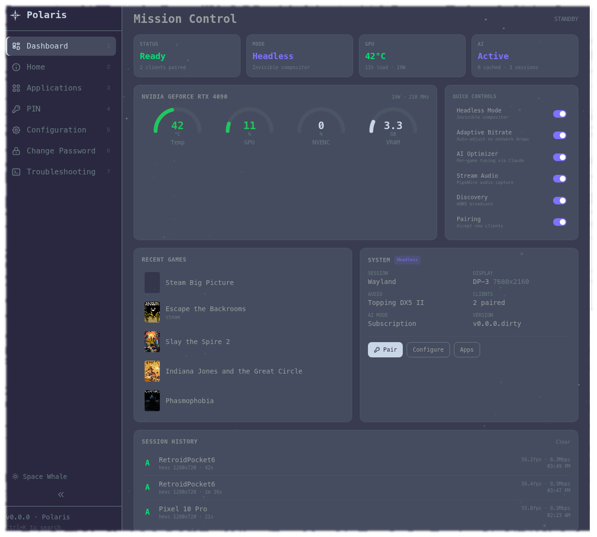 | 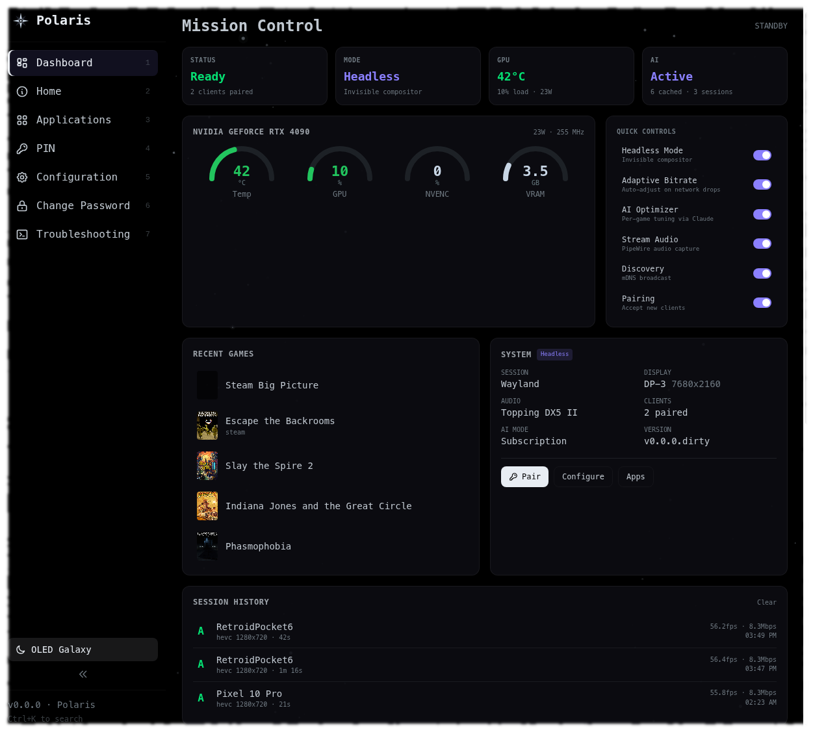 |
| <sub>Mission Control — GPU gauges, quick controls, games, history</sub> | <sub>Mission Control</sub> |
| 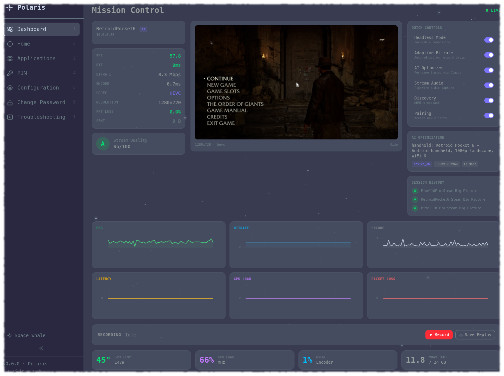 | 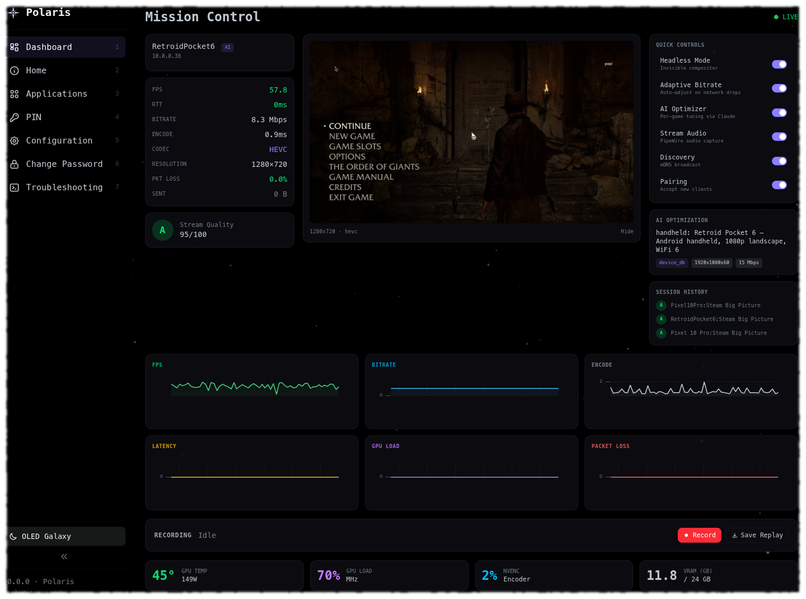 |
| <sub>Streaming — live preview, 6 charts, GPU telemetry bar</sub> | <sub>Streaming</sub> |
| 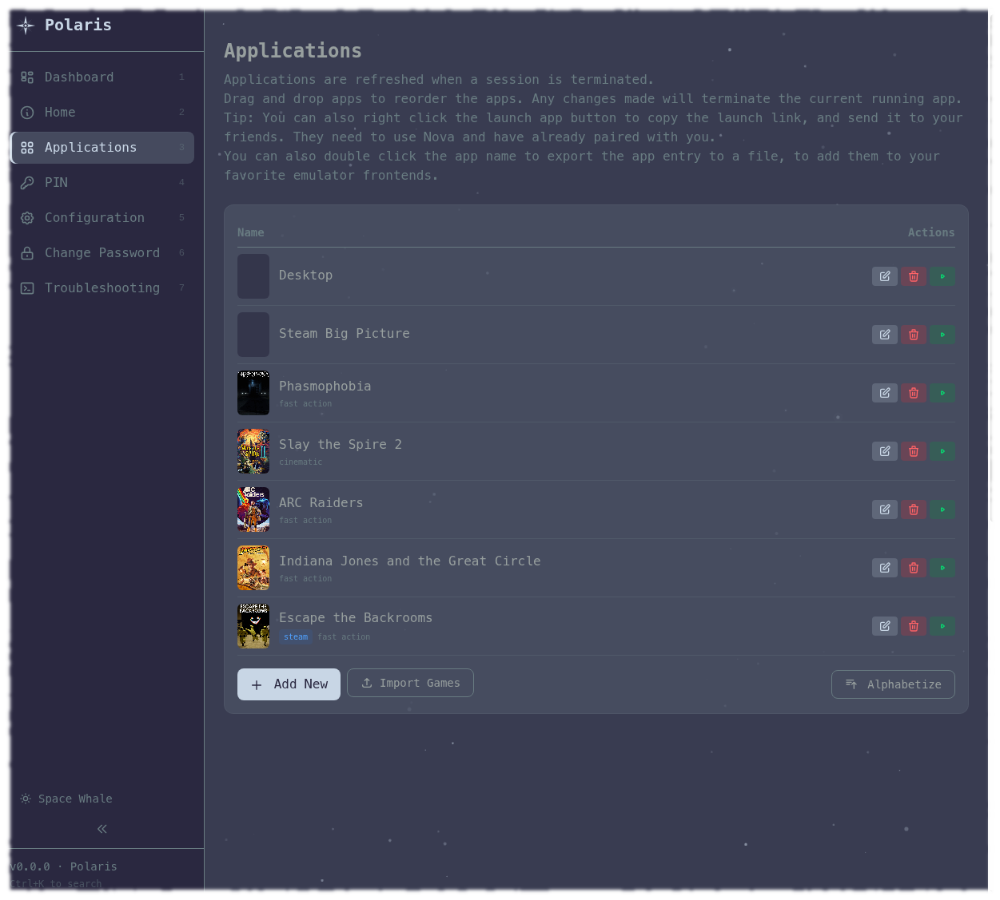 | 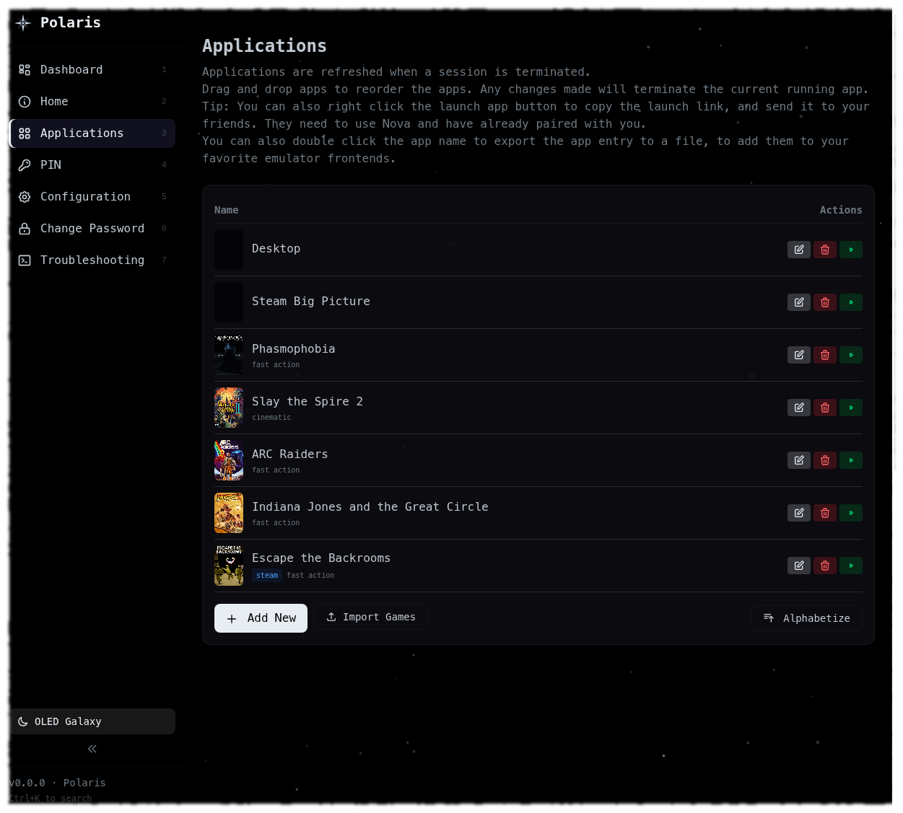 |
| <sub>Applications — cover art, categories, import + reorder</sub> | <sub>Applications</sub> |
| 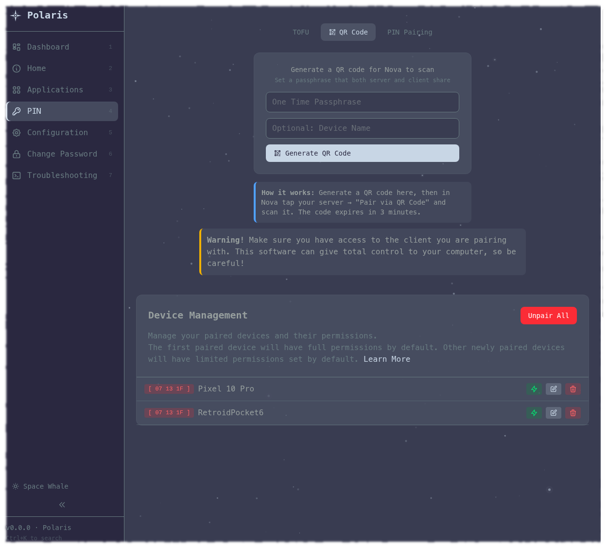 | 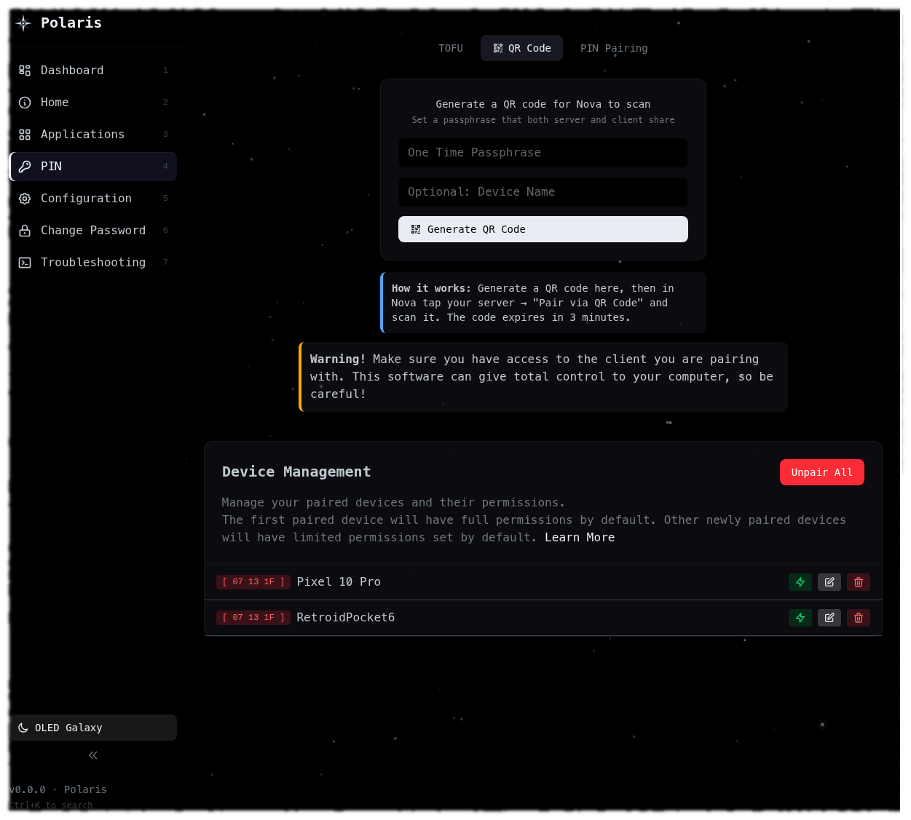 |
| <sub>Pairing — QR Code, TOFU, PIN tabs + device management</sub> | <sub>Pairing</sub> |

<details>
<summary><b>More pages</b></summary>

| Space Whale | OLED Dark Galaxy |
|:-----------:|:----------------:|
| 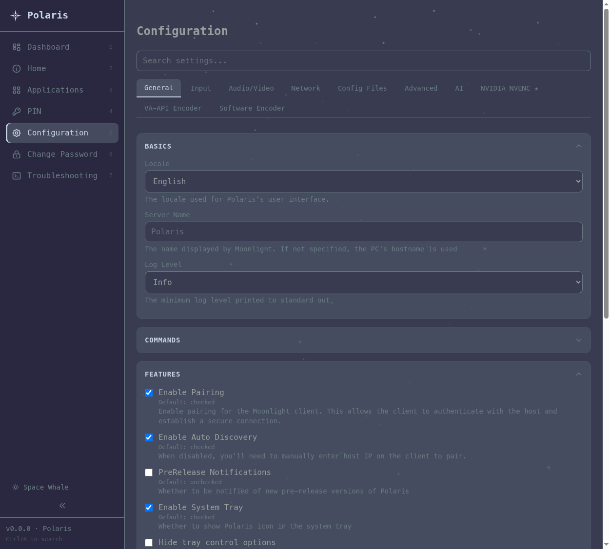 |  |
| <sub>Configuration — General, Input, A/V, Network, AI, NVENC</sub> | <sub>Configuration</sub> |
| 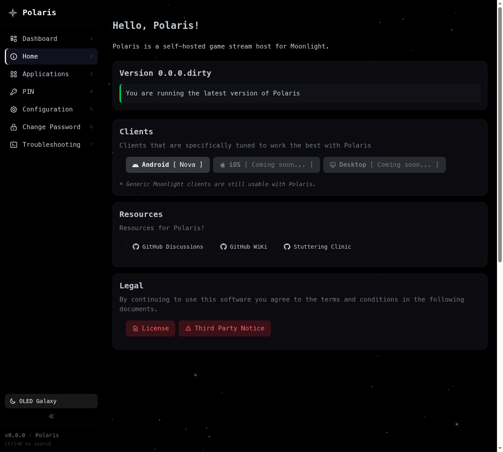 | 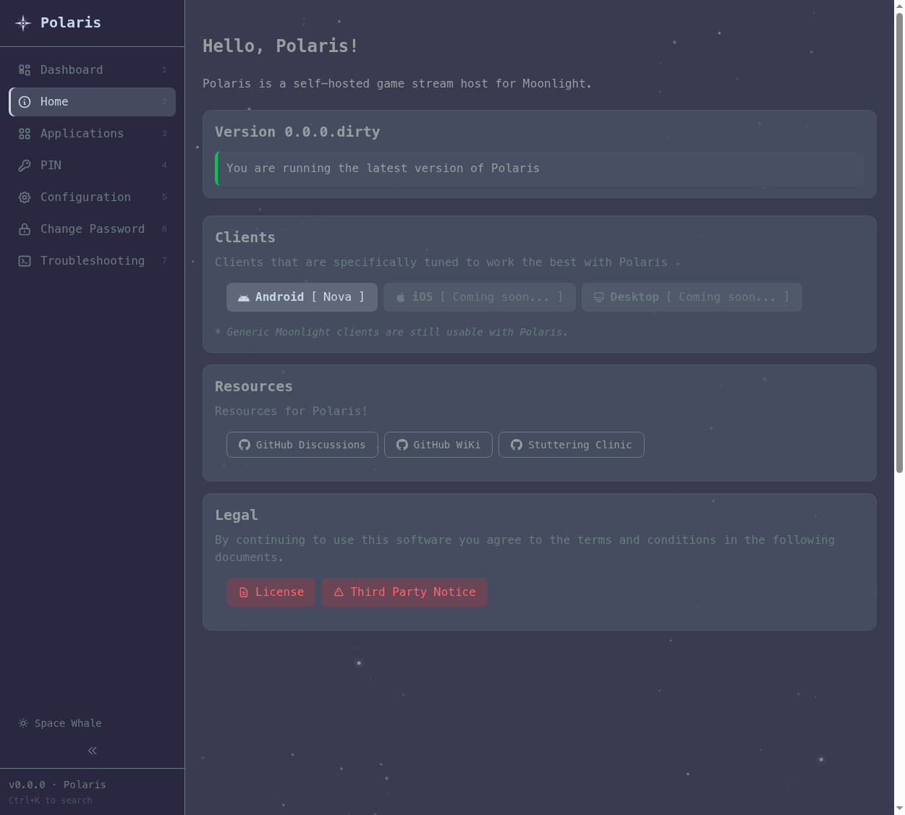 |
| <sub>Home — version, clients, resources</sub> | <sub>Home</sub> |

</details>

---

## How It Works

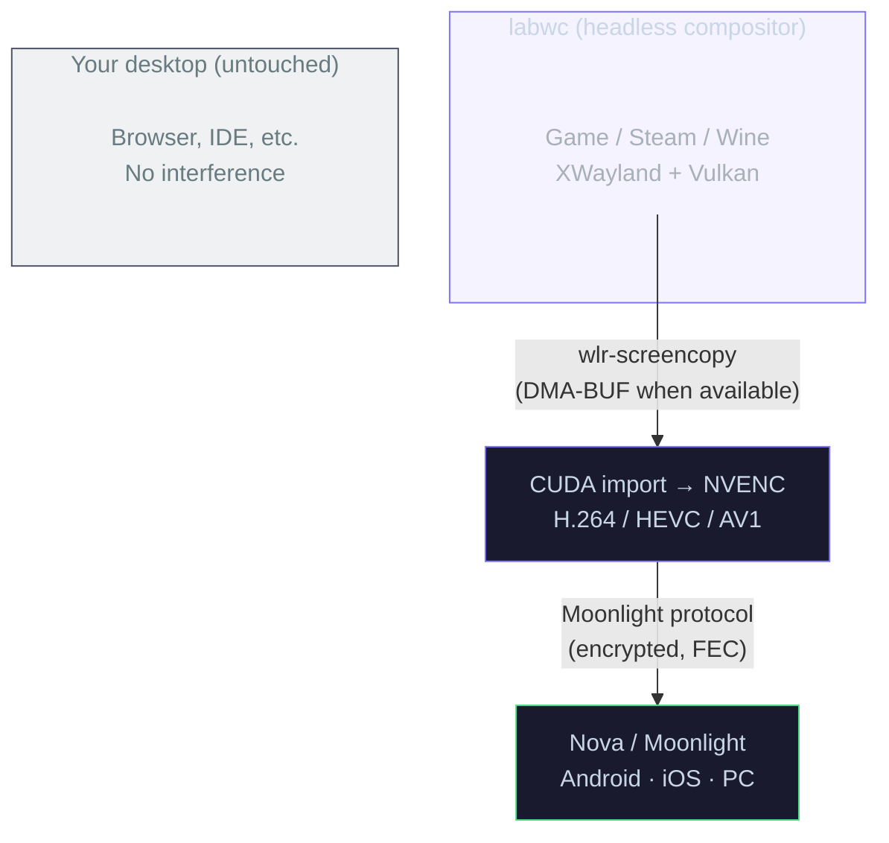

<details>
<summary><b>Session lifecycle details</b></summary>

- MangoHud environment isolated from compositor — cleared before fork, re-injected in game launch command
- D-Bus lock screen inhibitor prevents idle lock during streaming
- XWayland persistence mode for Proton/Wine game compatibility
- End button cleanly kills labwc and all child processes
- Encoder capabilities probed once, cached by driver version for fast restarts
- Multi-viewer: up to 8 simultaneous clients watching the same stream (configurable via `max_sessions`)

</details>

<details>
<summary><b>Linux Runtime Notes</b></summary>

- `headless_mode` requests an invisible labwc session.
- `linux_prefer_gpu_native_capture=enabled` allows Polaris to override true headless mode and run labwc windowed when NVENC or VAAPI needs the GPU-native path.
- The dashboard and stream stats surface:
  - requested headless mode
  - effective runtime mode
  - whether the GPU-native override is active
  - actual capture transport, residency, and format
- `linux_capture_profile=enabled` logs p50 and p99 capture timings for dispatch, ingest, and total capture time, tagged by transport.
- Current Linux goal is pragmatic, not magical: preserve GPU-native capture when the stack allows it, and make SHM fallback obvious when it does not.

</details>

<details>
<summary><b>Polaris v1 REST API</b></summary>

Endpoints at `https://localhost:47984/polaris/v1/`, authenticated via Moonlight pairing certificates:

| Method | Endpoint | Description |
|--------|----------|-------------|
| `GET` | `/capabilities` | Server features, encoding support, capture backend |
| `GET` | `/session/status` | Active session state (also available as SSE) |
| `GET` | `/games` | Game library with metadata, genres, cover art |
| `POST` | `/session/launch` | Launch game (accepts client display dimensions) |
| `POST` | `/session/bitrate` | Adjust bitrate mid-stream |
| `POST` | `/session/report` | Client quality report at disconnect |
| `GET` | `/optimize` | AI-recommended settings for device + game |
| `POST` | `/games/{id}/mangohud` | Toggle MangoHud per-game |

</details>

---

## Polaris vs Sunshine

| | Polaris | Sunshine |
|---|---|---|
| **Display handling** | Headless compositor — desktop untouched | Switches physical displays |
| **Capture** | GPU-native DMA-BUF when available, explicit SHM fallback visibility | Software copy to CPU |
| **AI optimization** | Claude per-device per-game tuning | — |
| **Dashboard** | Mission Control: GPU telemetry, 6 live charts, preview | Basic settings page |
| **Pairing** | TOFU + QR code + PIN | PIN only |
| **Game library** | Steam + Lutris + Heroic + SteamGridDB art | Steam only |
| **Adaptive bitrate** | EWMA mid-stream adjustment | — |
| **Audio** | Opus DRED (100ms redundancy) | Standard Opus |
| **Multi-viewer** | Up to 8 clients on one stream | Single client |
| **Session quality** | A–F grading with feedback loop | — |
| **Live preview** | Screenshot from labwc socket | — |
| **Recording** | Start/stop/replay from dashboard | — |

---

## Installation

Current install guidance is for Linux source builds.

### Dependencies

| Package | Why |
|---------|-----|
| CMake 3.25+ | Build system |
| Boost 1.80+ | Core libraries |
| OpenSSL | TLS / pairing crypto |
| libevdev | Input device handling |
| PipeWire | Audio capture |
| wayland-client | Compositor integration |
| CUDA toolkit | NVENC hardware encoding |
| Node.js 18+ | Frontend build (npm) |
| labwc | Headless compositor |

<details>
<summary><b>Fedora one-liner</b></summary>

```bash
sudo dnf install cmake gcc-c++ boost-devel openssl-devel libevdev-devel \
  pipewire-devel wayland-devel libdrm-devel libcap-devel \
  mesa-libEGL-devel mesa-libGL-devel cuda-toolkit nodejs npm labwc
```

</details>

<details>
<summary><b>Arch one-liner</b></summary>

```bash
sudo pacman -S cmake boost openssl libevdev pipewire wayland \
  libdrm libcap mesa cuda nodejs npm labwc
```

</details>

### Build from source

```bash
git clone --recursive https://github.com/papi-ux/polaris.git
cd polaris
cmake -B build -DCMAKE_BUILD_TYPE=Release -DPOLARIS_ENABLE_CUDA=ON
cmake --build build -j$(nproc)
```

### Install

```bash
# Installs: binary, web UI, optional user service unit, desktop entry, icons, host-setup assets
sudo cmake --install build
```

### Host Setup

```bash
# Virtual input and controller support
sudo polaris --setup-host

# Only if you need DRM/KMS capture
sudo polaris --setup-host --enable-kms
```

### Run

```bash
polaris
```

Open **https://localhost:47990** by default, create your password, and you're streaming.
If you changed `port` in `~/.config/polaris/polaris.conf`, the web UI is available at `https://localhost:<port + 1>`.

### Optional Autostart

```bash
systemctl --user enable --now polaris
```

### RPM package

```bash
cpack --config build/CPackConfig.cmake -G RPM
sudo rpm -i build/cpack_rpm/Polaris.rpm
```

> [!WARNING]
> Only grant `cap_sys_admin` when you actually need DRM/KMS capture. Polaris runs fine without it on the default compositor and portal paths.

---

## Configuration

Config file: `~/.config/polaris/polaris.conf`

```ini
# Headless mode (recommended)
headless_mode = enabled
linux_use_cage_compositor = true
linux_prefer_gpu_native_capture = enabled

# TOFU auto-pairing for your LAN
trusted_subnets = ["10.0.0.0/24"]

# Encoding
encoder = nvenc

# AI Optimizer
ai_enabled = enabled
ai_use_subscription = enabled   # or: ai_api_key = sk-ant-...

# Adaptive bitrate
adaptive_bitrate_enabled = enabled

# Multi-viewer (default: 2, max: 8)
max_sessions = 2
```

> [!TIP]
> In headless mode you don't need KDE window rules, kscreen-doctor scripts, HDMI dummy plugs, or portal configuration. Just enable it and stream.

<details>
<summary><b>All options</b></summary>

| Key | Default | Description |
|-----|---------|-------------|
| `headless_mode` | `disabled` | Invisible labwc compositor |
| `linux_use_cage_compositor` | `false` | Enable labwc for capture |
| `linux_prefer_gpu_native_capture` | `enabled` | Prefer DMA-BUF/GPU-native capture even if labwc must run windowed |
| `trusted_subnets` | `[]` | CIDR blocks for TOFU auto-pairing |
| `encoder` | `nvenc` | Encoder: `nvenc`, `vaapi`, `software` |
| `ai_enabled` | `disabled` | Claude AI optimizer |
| `ai_use_subscription` | `disabled` | Use Claude subscription vs API key |
| `adaptive_bitrate_enabled` | `disabled` | Mid-stream bitrate adjustment |
| `max_sessions` | `2` | Simultaneous viewers (0 = unlimited, max 8) |
| `enable_pairing` | `enabled` | Accept new client pairing |
| `enable_discovery` | `enabled` | mDNS broadcast |
| `stream_audio` | `enabled` | PipeWire audio capture |
| `steamgriddb_api_key` | — | Cover art for non-Steam games |

</details>

---

## Client

<div align="center">

### [Nova](https://github.com/papi-ux/nova)

The Polaris-aware Android streaming client. TOFU auto-pairing, interactive HUD,
AI quality presets, gyro aiming, audio haptics, and Material You theming.

[](https://apps.obtainium.imranr.dev/redirect?r=obtainium://app/%7B%22id%22%3A%20%22com.papi.nova%22%2C%20%22url%22%3A%20%22https%3A//github.com/papi-ux/nova%22%2C%20%22author%22%3A%20%22papi-ux%22%2C%20%22name%22%3A%20%22Nova%22%7D)
&nbsp;
[](https://github.com/papi-ux/nova/releases/latest)

Also compatible with [Moonlight](https://moonlight-stream.org) on any platform.

</div>

---

<details>
<summary><b>Color Palettes</b></summary>

**Space Whale** (default)

| Swatch | Name | Hex | Usage |
|--------|------|-----|-------|
|  | Ice | `#c8d6e5` | Primary text |
|  | Silver | `#a8b0b8` | Secondary text |
|  | Storm | `#687b81` | Muted, borders |
|  | Twilight | `#4c5265` | Cards |
|  | Void | `#2a2840` | Deep backgrounds |
|  | Navy | `#1a1a2e` | Window background |
|  | Accent | `#7c73ff` | Interactive elements |

**OLED Dark Galaxy**

| Swatch | Name | Hex | Usage |
|--------|------|-----|-------|
|  | Ice | `#e0e6ed` | Primary text |
|  | Silver | `#a8b0b8` | Secondary text |
|  | Storm | `#555e66` | Muted, borders |
|  | Divider | `#1a1a22` | Dividers |
|  | Abyss | `#0a0a0e` | Cards, elevated surfaces |
|  | Black | `#000000` | Window background |
|  | Accent | `#8b80ff` | Interactive elements |

</details>

---

## FAQ

<details>
<summary><b>Does Polaris work with Moonlight on iOS / PC / Mac?</b></summary>

Yes. Polaris speaks the standard Moonlight protocol. Any Moonlight client can connect and stream. The Polaris-specific features (AI optimization, TOFU pairing, session quality reports) require [Nova](https://github.com/papi-ux/nova) on Android.

</details>

<details>
<summary><b>Do I need an NVIDIA GPU?</b></summary>

NVENC (NVIDIA) is the primary and most tested encoder. VAAPI (AMD/Intel) and software encoding are supported but not the focus of development. The headless compositor and DMA-BUF capture pipeline are NVIDIA-optimized.

</details>

<details>
<summary><b>Does headless mode work on Hyprland / Sway / GNOME?</b></summary>

The headless labwc compositor is display-server agnostic — it creates its own Wayland instance. It's been tested primarily on KDE Plasma Wayland but should work on any Wayland session. X11 sessions can use x11grab capture as a fallback (no headless mode).

</details>

<details>
<summary><b>My KDE display layout gets corrupted after streaming</b></summary>

This is exactly why Polaris exists. Enable headless mode (`headless_mode = enabled` + `linux_use_cage_compositor = true`) and Polaris will never touch your physical displays. If `linux_prefer_gpu_native_capture = enabled`, Polaris may temporarily choose a visible labwc window instead of true headless mode when that is required to keep NVENC/VAAPI on a GPU-native path. If you're still seeing layout issues, make sure you're not running Sunshine/Apollo alongside Polaris.

</details>

<details>
<summary><b>How does the AI optimizer work? Does it phone home?</b></summary>

The AI optimizer calls the Claude API (Anthropic) with your device specs, game metadata, and session history to get encoding recommendations. You can use your own API key or a Claude subscription. Results are cached locally for 7 days. No telemetry is sent anywhere else. You can disable it entirely with `ai_enabled = disabled`.

</details>

<details>
<summary><b>Can multiple people watch the same stream?</b></summary>

Yes. Set `max_sessions = N` in your config (default 2, max 8). All viewers share the same encoder output — the GPU load doesn't multiply per viewer. Each viewer gets their own encrypted connection.

</details>

<details>
<summary><b>How do I pair a new device?</b></summary>

Three ways: **TOFU** (auto-pair on your LAN if `trusted_subnets` is configured), **QR Code** (generate in the web UI PIN tab, scan with Nova), or **manual PIN** (4-digit code). First paired device gets full permissions; subsequent devices get view-only by default.

</details>

<details>
<summary><b>Steam Big Picture doesn't show / shows a black screen</b></summary>

Clear Steam's HTML cache: `rm -rf ~/.local/share/Steam/config/htmlcache/`. Steam caches window geometry from a previous session and can render at 10x10 pixels inside the compositor. After clearing, restart the stream.

</details>

---

## Donate

I build Polaris and Nova in my spare time because I believe Linux game streaming deserves better. If you find it useful, a donation helps keep development going.

[](https://ko-fi.com/papiux)
&nbsp;
[](https://www.paypal.com/donate/?hosted_button_id=KD9R5KLYF6GN4)

Thank you to everyone who's supported the project — you're the reason it keeps getting better.

---

## Contributing

Contributions are welcome — bug fixes, new features, documentation, translations.

1. Fork the repo and create a branch from `master`
2. Make your changes and test them locally (`cmake --build build && sudo cmake --install build`)
3. For frontend changes, run `npm run build` in the repo root before testing
4. Open a pull request with a clear description of what changed and why

> [!NOTE]
> The web UI is Vue 3 + Tailwind CSS v4 in `src_assets/common/assets/web/`. The C++ backend lives in `src/`. Both are built together via CMake.

---

## License

Polaris is licensed under the **GNU General Public License v3.0** — see [LICENSE](LICENSE) for the full text.

Polaris is a fork of [Apollo](https://github.com/ClassicOldSong/Apollo) by ClassicOldSong, which is itself a fork of [Sunshine](https://github.com/LizardByte/Sunshine) by LizardByte. Both are GPLv3. The streaming protocol is compatible with [Moonlight](https://moonlight-stream.org) clients.
