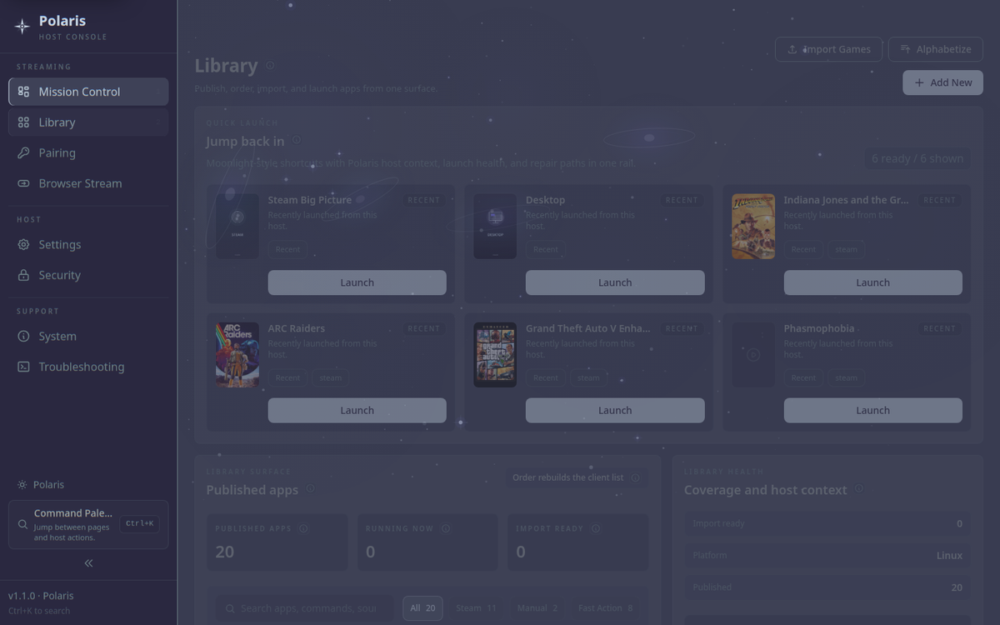

<div align="center">


# Polaris
**Self-hosted game streaming for Linux.**

Stream PC games to Nova and Moonlight clients without letting the stream take
over your desktop. Polaris combines an isolated Linux compositor runtime,
GameStream-compatible pairing, GPU-aware capture, and a web console that shows
what the host is actually doing.

[](https://github.com/papi-ux/polaris/stargazers)
[](LICENSE)
[](https://github.com/papi-ux/polaris/releases/latest)

[Features](#feature-matrix) · [Quick Start](#quick-start) · [Install](#install) · [Compatibility](#compatibility) · [Launch Modes](#launch-modes-explained) · [Tour](#tour) · [Nova](#use-with-nova) · [Support](#support-and-bug-reports) · [FAQ](#faq) · [Security](SECURITY.md) · [Changelog](docs/changelog.md) · [Roadmap](ROADMAP.md)

**Support**: [Issues](https://github.com/papi-ux/polaris/issues) · [Discussions](https://github.com/papi-ux/polaris/discussions)

<br/>

<picture>
  
</picture>

</div>

> [!IMPORTANT]
> Polaris is a Linux host today. Fedora 42/43/44 and Arch Linux are the recommended package paths. CachyOS generally follows the Arch package path; Bazzite and Ubuntu 24.04 are tester package paths; openSUSE Tumbleweed builds from source with a dedicated guide.

> [!NOTE]
> Start with **Headless Stream** if you want games to launch into a stream-only runtime without changing your KDE, GNOME, or wlroots desktop layout.

## Feature Matrix

| Feature | Status | Why it matters |
|---|---|---|
| Headless Stream runtime | Recommended path | Launches games into a stream-only compositor instead of rearranging your physical desktop |
| Nova-aware launch contract | Supported | Lets Nova show Private Stream, Host Virtual Display, Mirror Desktop, watch/resume, and safety state before launch |
| Mission Control | Supported | Shows runtime, capture path, encoder, clients, stream health, and host actions in one cockpit |
| Portable Chrome web UI | Supported | v1.2 smoked graphite / dim Moonlight-grey interface with clearer panels and safer action feedback |
| Game Control pairing preset | Supported | Trusted clients can browse, launch, and send input without broad server-admin permissions |
| AI Auto Quality | Optional | Provider-configured tuning and recovery guidance; core streaming does not require AI or cloud services |
| Browser Stream | Experimental | Chromium-oriented WebTransport/WebCodecs streaming path for browser testing |
| HDR / Main10 | Conditional | Main10 SDR can work when requested; true HDR requires real HDR metadata from the active capture path |
| AMD / VAAPI and software encode | Supported, expanding validation | AMD/Intel VAAPI and software fallback are supported; NVIDIA/NVENC remains the most exercised release target while AMD coverage grows |
| Wayland Portal/PipeWire desktop capture | Supported; conditional GPU acceleration | Captures real Portal frames through PipeWire, using same-GPU DMA-BUF when the selected render node and modifier are importable and system memory otherwise |

## Privacy and Local-First Defaults

Polaris is self-hosted by default. Pairing keys, client permissions, library state, stream settings, and web credentials live on your host. Core GameStream/Moonlight-compatible streaming does not require a Polaris cloud account.

AI Auto Quality is optional. If you enable it, Polaris uses the provider you configure, including local OpenAI-compatible endpoints such as Ollama or LM Studio. Keep it disabled if you want a purely local/non-AI host.

## Quick Start

### Fedora 42/43/44

```bash
fedora_version="$(rpm -E %fedora)"
wget "https://github.com/papi-ux/polaris/releases/latest/download/Polaris-fedora${fedora_version}-x86_64.rpm"
sudo dnf install "./Polaris-fedora${fedora_version}-x86_64.rpm"
sudo polaris --setup-host
polaris
```

### Arch Linux / CachyOS

```bash
wget https://github.com/papi-ux/polaris/releases/latest/download/Polaris-arch-x86_64.pkg.tar.zst
sudo pacman -U ./Polaris-arch-x86_64.pkg.tar.zst
sudo polaris --setup-host
polaris
```

CachyOS and most pacman-compatible Arch derivatives should start with the Arch package path. If a derivative has dependency naming or runtime helper differences, fall back to the source/local package flow in [Building Polaris](docs/building.md).

Open **https://localhost:47990/#/welcome**, create your web UI account, and pair a client. After credentials are created, **https://localhost:47990** opens the normal console.

### First stream checklist

1. Open the first-run setup at **https://localhost:47990/#/welcome**.
2. Confirm the recommended Linux path: `headless_mode = enabled`, `linux_use_cage_compositor = enabled`, and `linux_prefer_gpu_native_capture = enabled`.
3. Pair with Trusted Pair on a trusted LAN, QR pairing for Nova, or manual PIN for standard Moonlight clients.
4. Start a game from the Polaris library, Nova, or a Moonlight client.
5. Watch the live session dashboard to confirm the active runtime and encoder path.

> [!TIP]
> If you changed `port` in `~/.config/polaris/polaris.conf`, the web UI is at `https://localhost:<port + 1>`. If you want background autostart, enable the user service with `systemctl --user enable --now polaris`.

## What is New in v1.3.0

Polaris v1.3.0 turns the web console into a stronger self-service streaming cockpit: diagnose the host and live path, plan display modes before launch, see updates without spelunking GitHub, and recover more cleanly from Linux capture-environment drift.

- **Polaris Doctor and support reports**: deterministic host, stream, and post-session findings now drive privacy-safe support bundles, self-tests, and issue drafts; optional AI explanations translate the evidence without replacing it.
- **Network and controller truth**: native probes surface route, reachability, latency, packet loss, controller isolation, and haptics evidence so support can stop blaming the nearest random subsystem.
- **Display planning before launch**: the resolution planner compares client requests, host capabilities, capture constraints, and output modes before a stream starts.
- **Update Center**: Mission Control can check release metadata and expose package-aware update guidance without silently mutating the host.
- **More resilient Linux capture**: stale desktop environment values self-heal, while headless DMA-BUF conversion failures fall back instead of stranding the session.
- **Clearer GPU guidance**: public docs now explain NVIDIA, AMD/VAAPI, GPU-native, and fallback behavior with less vendor-specific fog.
See the [changelog](docs/changelog.md) for the full release history.

## Install

Use the release package for your distro before considering source builds. Packages install the host binary, web console assets, desktop metadata, and user service file; host integration remains explicit through `sudo polaris --setup-host`.

| Host | Best path |
|---|---|
| Fedora 42 | `Polaris-fedora42-x86_64.rpm` from the latest release |
| Fedora 43 | `Polaris-fedora43-x86_64.rpm` from the latest release |
| Fedora 44 | `Polaris-fedora44-x86_64.rpm` from the latest release |
| Arch Linux | `Polaris-arch-x86_64.pkg.tar.zst` from the latest release |
| CachyOS / Arch derivatives | Start with the Arch package; source/local package fallback if a derivative drifts |
| Bazzite 44 | Layer the matching Fedora 44 RPM with `rpm-ostree`; see [Bazzite guide](docs/bazzite.md) |
| Ubuntu 24.04 | `Polaris-ubuntu24.04-x86_64.deb` experimental tester path; see [Ubuntu guide](docs/ubuntu.md) |
| openSUSE Tumbleweed | Source build; see [openSUSE guide](docs/openSUSE.md) |
| Debian-family, Leap, NixOS, Gentoo, or custom host | Source build; see [Building Polaris](docs/building.md) |

Detailed source builds, local Arch package builds, distro dependency lists, openSUSE notes, and Browser Stream build flags live in [docs/building.md](docs/building.md).

> [!WARNING]
> Only grant `cap_sys_admin` with `sudo polaris --setup-host --enable-kms` when you actually need DRM/KMS capture. Polaris works fine without it on the default compositor and Headless Stream paths.

## Compatibility

| Area | Status | Notes |
|---|---|---|
| Linux host OS | Supported | Polaris is Linux-first today |
| Fedora 42/43/44 | Recommended | Official RPM assets and most validated release path |
| Arch Linux | Recommended | Official package asset |
| CachyOS / Arch derivatives | Expected via Arch package | Pacman-compatible derivatives should start here; report derivative-specific dependency/runtime gaps |
| Bazzite | Experimental | Layer the Fedora RPM with `rpm-ostree`; Desktop Mode validated on NVIDIA with Headless Stream; real Steam/Game Mode needs more coverage |
| Ubuntu 24.04 | Experimental tester path | DEB asset is available, but this path needs broader real-hardware validation |
| openSUSE Tumbleweed | Source-build supported | Dedicated dependency/build guide and CI build coverage; no published release package asset yet |
| Debian-family distros | Source-build oriented | Ubuntu 24.04 is the only direct DEB asset today |
| Other Linux distros | Source-build/community validation | Bring distro, GPU, driver, compositor, and package details when reporting success or breakage |
| NVIDIA / NVENC | Best-tested | Main fast path and most validated encoder/runtime combination |
| AMD / VAAPI | Supported, expanding validation | Mesa VAAPI is the Linux AMD baseline; GPU-native DMA-BUF is preferred when available and reported truthfully when it falls back |
| Software encode | Supported fallback | Useful for diagnostics and unsupported hardware, but not the performance target |
| Nova for Android | Best experience | Full launch contract, watch mode, tuning, and richer live state |
| Standard Moonlight clients | Compatible | Core streaming works without Nova-specific UX |
| Browser Stream | Experimental | Browser-based streaming path using WebTransport and WebCodecs; best tested on Chromium-family browsers |

### Best-tested first setup

If you want the smoothest first run, start here:

- **Host distro**: Fedora 44 or Arch Linux / CachyOS.
- **GPU path**: NVIDIA/NVENC is the most validated path; AMD/Mesa VAAPI is supported and should use the same Headless Stream flow with capture-path truth in Mission Control.
- **Desktop**: KDE Plasma Wayland is the most exercised daily-driver setup, but Headless Stream launches its own compositor and is not KDE-only.
- **Config**: `headless_mode = enabled`, `linux_use_cage_compositor = enabled`, `linux_prefer_gpu_native_capture = enabled`.
- **Client**: Nova on an ARM64 Android handheld / Android TV device, or a standard Moonlight client for the core stream path.

## Known Limitations

- Polaris is not a Windows host today. Linux is the supported platform.
- Fedora and Arch are the most validated package paths; CachyOS should use the Arch path first, but derivative-specific issues still need reports.
- Bazzite support is experimental. Desktop Mode has Headless Stream validation on NVIDIA and growing AMD/Mesa VAAPI coverage; real Steam/Game Mode and Steam Deck client flows need more hardware reports.
- Ubuntu 24.04 DEB packaging is experimental; other Debian-family distros are still source-build oriented.
- openSUSE Tumbleweed has source-build guidance and CI coverage, but no published release package asset yet; Leap and other RPM distros should start from source.
- NVIDIA/NVENC is the most heavily validated hardware path. AMD/Mesa VAAPI is supported and should stay visible in docs/UI, but it still needs broader real-hardware coverage before claiming parity.
- Some UX surfaced in Nova, such as explicit launch recommendations, watch mode polish, and live tuning, depends on the Nova Android client.
- MangoHud can still be risky on Steam Big Picture and some Steam/Proton launches.

## Why Polaris

Traditional Linux streaming hosts often treat your real desktop as disposable: mode switches, broken layouts, portal prompts, and post-session cleanup are all your problem.

Polaris takes a different route:

- **Desktop-safe streaming**: games run in a dedicated compositor instead of hijacking your normal desktop layout
- **Runtime transparency**: the dashboard shows the real backend, transport, frame residency, and format
- **Headless-first Linux path**: designed to avoid HDMI dummy plugs, display scripts, and manual compositor surgery
- **Practical control surface**: live preview, telemetry, quality controls, library management, and pairing in one UI
- **Shared viewing**: additional clients can watch an active stream without stealing ownership

## Launch Modes Explained

Polaris is explicit about launch intent because a request to stream the game can mean several very different things on a Linux host.

| Mode | What it does | Use when |
|---|---|---|
| Private Headless Stream | Starts the game inside the isolated Polaris headless runtime | You want the safest handheld/remote play path without touching the real desktop |
| Host Virtual Display | Uses a separate host-side virtual display path when available | You want display-like behavior without reusing the physical monitor |
| Mirror Desktop | Streams the existing desktop/session | You intentionally want to show or control what is on the host right now |
| Direct Steam/Game launch | Starts a specific app/game through the configured runtime | You know what you want to launch and want the shortest path |
| Watch Stream | Lets another client view an already active compatible session | You want a second device to observe without stealing ownership |

Nova can show these choices before launch when Polaris exposes the capability contract. Standard Moonlight clients still work, but they usually cannot explain this decision tree before the stream starts.

## For Sunshine, Apollo, and Moonlight Users

Polaris keeps the GameStream/Moonlight-compatible protocol lineage while changing the Linux host model.

- You do **not** need to uninstall Sunshine or Apollo to try Polaris, but do not run multiple hosts on the same default ports at the same time.
- Standard Moonlight clients work for core pairing, app launch, and streaming.
- Nova unlocks richer Polaris-specific UX: launch-mode choice, watch/resume state, live tuning, Polaris Sync, and clearer health diagnostics.
- Polaris focuses on Linux host safety: headless runtime, capture-path truth, input isolation, and cleanup that does not treat your desktop as disposable confetti.

## Use with Nova

[Nova](https://github.com/papi-ux/nova) is the Polaris-aware Android client and the best way to experience the newer host features.

| Polaris + Nova capability | What it means |
|---|---|
| Launch contract | Polaris tells Nova which launch modes are preferred, recommended, and currently allowed |
| Headless vs Virtual Display | Nova can present both choices directly in the library instead of silently guessing |
| 10-bit SDR | Nova can explicitly request a Main10 stream even on SDR handheld panels when the host supports it |
| Watch Stream | A second device can join as a viewer without taking over the owner session |
| AI recommendations | Nova can distinguish baseline device tuning, live AI, cached AI, recovery tuning, and host-adjusted runtime notes |
| Live tuning | Adaptive Bitrate, AI Optimizer, and MangoHud can be surfaced directly in Nova’s quick menu |
| Session truth | HUD and quick menu can show live server-backed mode, role, shutdown state, and tuning state |

<div align="center">

[](https://apps.obtainium.imranr.dev/redirect?r=obtainium://app/%7B%22id%22%3A%22com.papi.nova%22%2C%22url%22%3A%22https%3A%2F%2Fgithub.com%2Fpapi-ux%2Fnova%22%2C%22author%22%3A%22papi-ux%22%2C%22name%22%3A%22Nova%22%2C%22additionalSettings%22%3A%22%7B%5C%22apkFilterRegEx%5C%22%3A%5C%22app-nonRoot_game-arm64-v8a-release%5C%5C%5C%5C.apk%24%5C%22%2C%5C%22versionExtractionRegEx%5C%22%3A%5C%22v%28.%2B%29%5C%22%2C%5C%22matchGroupToUse%5C%22%3A%5C%221%5C%22%7D%22%7D)
&nbsp;
[](https://github-store.org/app?repo=papi-ux/nova)
&nbsp;
[](https://github.com/papi-ux/nova/releases/latest)

</div>

The Obtainium shortcut is prefiltered to Nova's public `app-nonRoot_game-arm64-v8a-release.apk` asset so updates resolve cleanly. Polaris is also compatible with standard [Moonlight](https://moonlight-stream.org) clients on any platform.

## Tour

### Mission Control

Polaris is built around a dashboard that answers the questions stream hosts usually have to reverse-engineer from logs: what runtime is active, what capture path is in use, whether the GPU-native path survived, and how much headroom remains.

<p align="center">
  <picture>
    
  </picture>
</p>

### Live Session View

When a stream is active, Polaris shifts from setup to operations: preview, charts, runtime-path telemetry, recording controls, and recommendations are visible in one place.

<p align="center">
  <picture>
    
  </picture>
</p>

### Library and Pairing

<table>
  <tr>
    <td width="50%" valign="top">
      <picture>
        
      </picture>
      <p><strong>Game library</strong><br/>Import from Steam, Lutris, and Heroic, attach art, organize categories, and tune launch behavior.</p>
    </td>
    <td width="50%" valign="top">
      <picture>
        
      </picture>
      <p><strong>Pairing</strong><br/>Use Trusted Pair (TOFU), QR for Nova, or manual PIN pairing for standard Moonlight clients.</p>
    </td>
  </tr>
</table>

<details>
<summary><b>More screens</b></summary>

<table>
  <tr>
    <td width="50%" valign="top">
      <picture>
        <source media="(prefers-color-scheme: light)" srcset="docs/screenshots/configuration.png" width="100%" />
        <source media="(prefers-color-scheme: dark)" srcset="docs/screenshots/configuration-oled.png" width="100%" />
        
      </picture>
      <p><strong>Configuration</strong><br/>General, input, audio/video, network, AI, and encoder settings in one place.</p>
    </td>
    <td width="50%" valign="top">
      <picture>
        <source media="(prefers-color-scheme: light)" srcset="docs/screenshots/troubleshooting.png" width="100%" />
        <source media="(prefers-color-scheme: dark)" srcset="docs/screenshots/troubleshooting-oled.png" width="100%" />
        
      </picture>
      <p><strong>Troubleshooting</strong><br/>Inspect diagnostics without jumping between CLI tools and guesswork.</p>
    </td>
  </tr>
</table>

</details>

## How It Works

Polaris launches games into a dedicated stream runtime, captures that runtime instead of your desktop session, and routes frames into the best available encoder path for the host.

The practical result: your real desktop can keep its layout, refresh rate, and windows while the stream gets its own controlled environment. The dashboard shows the active runtime, capture transport, frame residency, encoder, and session role so you can verify what actually happened.

For the deeper runtime model, see [Runtime and Streaming Model](docs/runtime.md).

## Configuration

Config file: `~/.config/polaris/polaris.conf`

### Recommended first config

```ini
# Headless Stream path
headless_mode = enabled
linux_use_cage_compositor = enabled
linux_prefer_gpu_native_capture = enabled

# Pairing on your trusted LAN
trusted_subnets = ["10.0.0.0/24"]

# Encoding (choose for your GPU: nvenc on NVIDIA, vaapi on AMD/Intel)
encoder = nvenc

# Optional
adaptive_bitrate_enabled = enabled
max_sessions = 2
```


> [!TIP]
> With Headless Stream you generally do not need KDE window rules, `kscreen-doctor` scripts, HDMI dummy plugs, or manual portal juggling. Turn on the recommended stream runtime and let Polaris manage the compositor, app routing, and input isolation.

Full config tables, AI provider examples, HDR notes, and credential recovery steps live in [docs/configuration.md](docs/configuration.md).

## Docs

| Guide | Use it for |
|---|---|
| [Runtime and Streaming Model](docs/runtime.md) | Headless Stream, capture/encoder paths, Browser Stream, session lifecycle, HDR/Main10 behavior |
| [Configuration](docs/configuration.md) | Config file paths, common options, AI provider settings, credential reset |
| [Building Polaris](docs/building.md) | Source builds, local packages, distro dependencies, Browser Stream build flags |
| [openSUSE Build Guide](docs/openSUSE.md) | Tumbleweed dependency list, shared Boost notes, optional local RPM build |
| [Troubleshooting](docs/troubleshooting.md) | Runtime logs, capture fallbacks, audio/session issues |
| [Bazzite Install Guide](docs/bazzite.md) | Bazzite layering, validation status, rollback, Game Mode notes |
| [Ubuntu Install Guide](docs/ubuntu.md) | Ubuntu DEB status, source fallback, validation notes |

## FAQ

<details>
<summary><b>Do I need an NVIDIA GPU?</b></summary>

No. NVIDIA/NVENC is the most heavily tested path today, but AMD/Mesa VAAPI and software encode paths are supported. GPU-native/DMA-BUF capture is an optimization request on both NVIDIA and AMD-capable stacks; Polaris reports the actual path when a host falls back to SHM/system memory.

</details>

<details>
<summary><b>Does Polaris work with Moonlight on iOS, macOS, and PC?</b></summary>

Yes. Polaris speaks the Moonlight protocol. Any Moonlight client can connect. Polaris-specific features such as launch-mode selection, watch mode UX, optimization guidance, and richer session state require Nova on Android.

</details>

<details>
<summary><b>Do I need to uninstall Sunshine before trying Polaris?</b></summary>

No. Polaris keeps its host config separate at `~/.config/polaris`, so installing it should not remove or overwrite an existing Sunshine setup. For testing, stop Sunshine before starting Polaris because both are GameStream/Moonlight hosts and can collide on the same default ports and discovery records.

```bash
systemctl --user stop sunshine
systemctl --user enable --now polaris
```

If your Sunshine install runs as a system service instead of a user service, use the matching service command for your distro. You can switch back by stopping Polaris and starting Sunshine again.

</details>

<details>
<summary><b>Does Moonlight lock streams to 60 FPS?</b></summary>

No. Moonlight can request higher frame rates on clients that expose them, but Polaris treats the client's requested display mode as the ceiling. If a client requests `1280x800x60`, Polaris will not force a `90 FPS` optimization above that request even when the device profile supports it.

</details>

<details>
<summary><b>Does headless mode work on Hyprland, Sway, or GNOME?</b></summary>

The headless `labwc` runtime creates its own Wayland instance, so it is not tied to one desktop environment. Polaris has been tested most heavily on KDE Plasma Wayland, but the model is not KDE-specific.

</details>

<details>
<summary><b>How does Trusted Pair work?</b></summary>

Trusted Pair is Polaris’ TOFU flow. If the client is on a configured trusted subnet, Polaris can auto-approve first pairing. You can still use QR or manual PIN pairing if you want a stricter or more traditional flow.

</details>

<details>
<summary><b>Can Polaris stream 10-bit to an SDR handheld screen?</b></summary>

Yes, if the client explicitly requests a 10-bit path and the active encoder/runtime support Main10. See [Runtime and Streaming Model](docs/runtime.md) for the difference between 10-bit SDR and true HDR.

</details>

<details>
<summary><b>Can Polaris stream true HDR on Linux?</b></summary>

Yes, but Polaris only advertises true HDR when the active capture path reports HDR display metadata. Headless labwc/wlroots sessions remain honest SDR until that runtime can provide real metadata. See [Runtime and Streaming Model](docs/runtime.md) for details.

</details>

<details>
<summary><b>Can multiple people watch the same stream?</b></summary>

Yes. Set `max_sessions` above `1`. Polaris tracks owner vs viewer roles explicitly, and passive watch mode is designed so a second client can observe without taking over the session. Viewers must match the active owner profile rather than silently creating a different downgraded stream.

</details>

<details>
<summary><b>My KDE layout gets corrupted after streaming</b></summary>

That failure mode is the reason Polaris exists. Enable `headless_mode = enabled` and `linux_use_cage_compositor = enabled`, and Polaris will stop treating your physical displays as the stream path.

</details>

<details>
<summary><b>Steam Big Picture shows a black screen or tiny window</b></summary>

First clear Steam’s HTML cache:

```bash
rm -rf ~/.local/share/Steam/config/htmlcache/
```

Then avoid MangoHud on Steam Big Picture and Steam/Proton launches. Polaris and Nova now warn more aggressively there because MangoHud can crash helper processes before the session gets a usable frame.

</details>

<details>
<summary><b>How does the AI optimizer work?</b></summary>

The AI optimizer is optional and disabled by default. When enabled, it sends device specs, app metadata, and recent session history to the provider you configure: Anthropic, OpenAI, Gemini, or a local OpenAI-compatible endpoint such as Ollama or LM Studio. Results are cached locally.

</details>

## Support and Bug Reports

Great bug reports save everyone time. When reporting a Polaris host issue, include as much of this as you can without posting secrets:

- Distro and version, GPU model, driver version, desktop/compositor, and whether the session is Wayland or X11.
- Client used: Nova, Moonlight, Browser Stream, or another compatible client.
- Launch mode: Private Headless Stream, Host Virtual Display, Mirror Desktop, direct app, or watch/resume.
- Encoder path and whether Headless Stream is enabled.
- Relevant logs from `journalctl --user -u polaris` around the failed launch or stream.
- Screenshots or recordings for UI/video/input issues. Redact hostnames, tokens, LAN-only URLs, and pairing material if needed.

If you are comparing clients, say whether the same host/app works differently in Nova and in a standard Moonlight client. That comparison is extremely useful for separating host bugs from client UI bugs.

## AI Transparency

Polaris is a maintainer-led project. I use AI-assisted tools as research,
debugging, comparison, and drafting aids, especially when validating unfamiliar
Linux compositor, packaging, and client behavior.

Those tools do not decide what Polaris is or what ships. I review changes,
test every aspect, and own the final decisions around validation,
trust boundaries, and release quality.

## Contributing

Contributions are welcome, especially focused fixes, docs, translations, packaging improvements, and careful feature work. Polaris is still a small maintainer-led project, so the easiest pull requests to review are the ones that explain the problem clearly and keep the change scoped.

1. Fork the repo and branch from `master`.
2. Make your changes and test them locally.
3. For web UI changes, run `npm run lint`, `npm test`, and `npm run build` in the repo root.
4. For browser-facing changes, run `npm run test:e2e` against a local Polaris instance when possible.
5. Open a pull request that explains what changed, why it helps, and what you were able to test.

> [!NOTE]
> The web UI lives in `src_assets/common/assets/web/` and uses Vue 3 with Tailwind CSS v4. The backend lives in `src/`. CMake builds both together.

Polaris is a spare-time project built to make Linux game streaming safer, clearer, and easier to trust. If it becomes part of your setup, that alone makes my day. Bug reports, testing notes, and thoughtful feedback help too.

## License

Polaris is licensed under the **GNU General Public License v3.0**. See [LICENSE](LICENSE) for the full text.

Polaris builds on [Apollo](https://github.com/ClassicOldSong/Apollo) and [Sunshine](https://github.com/LizardByte/Sunshine) under GPLv3 lineage, and remains compatible with [Moonlight](https://moonlight-stream.org) clients.
