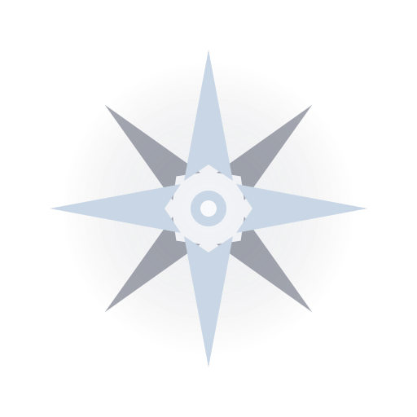
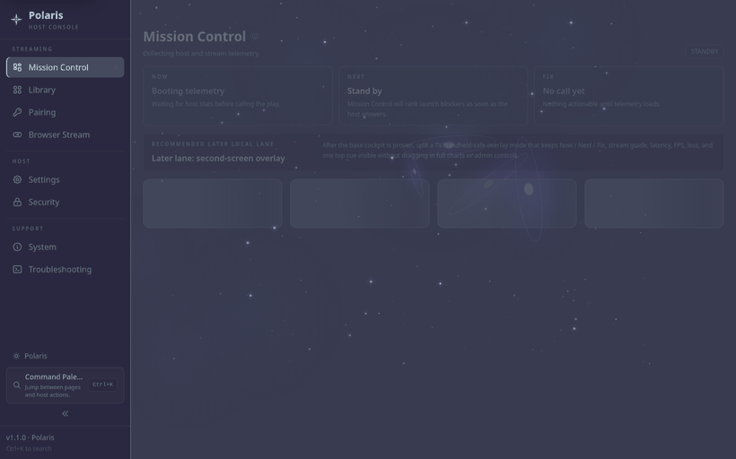
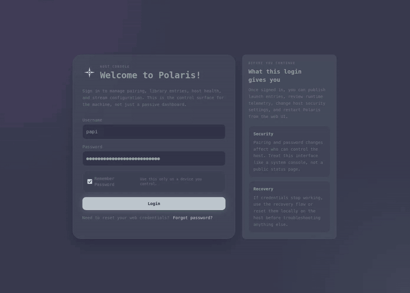
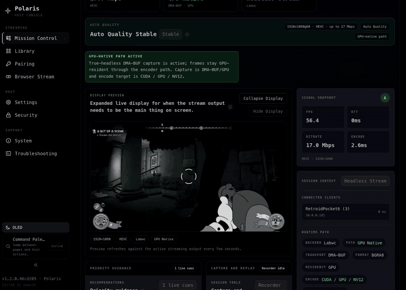
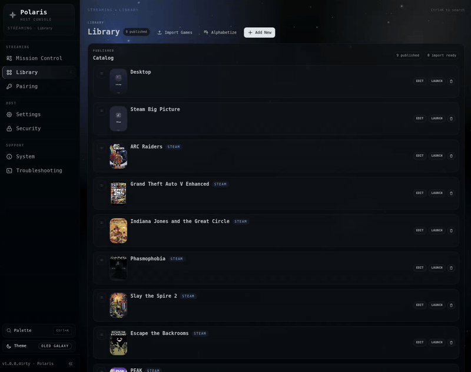
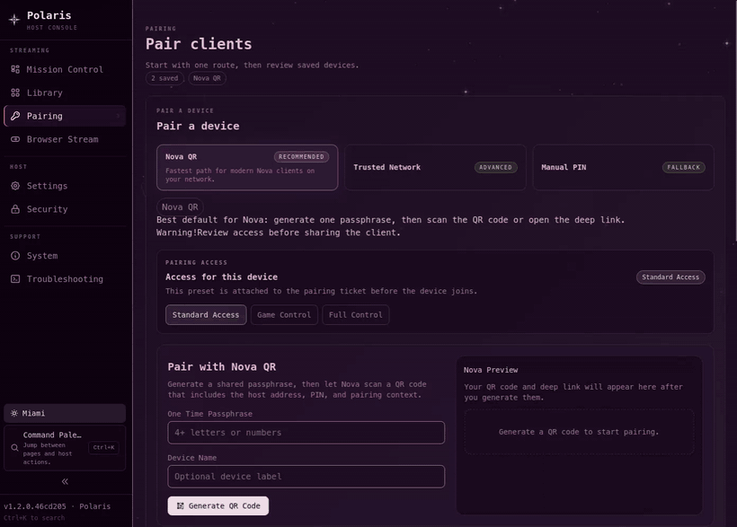
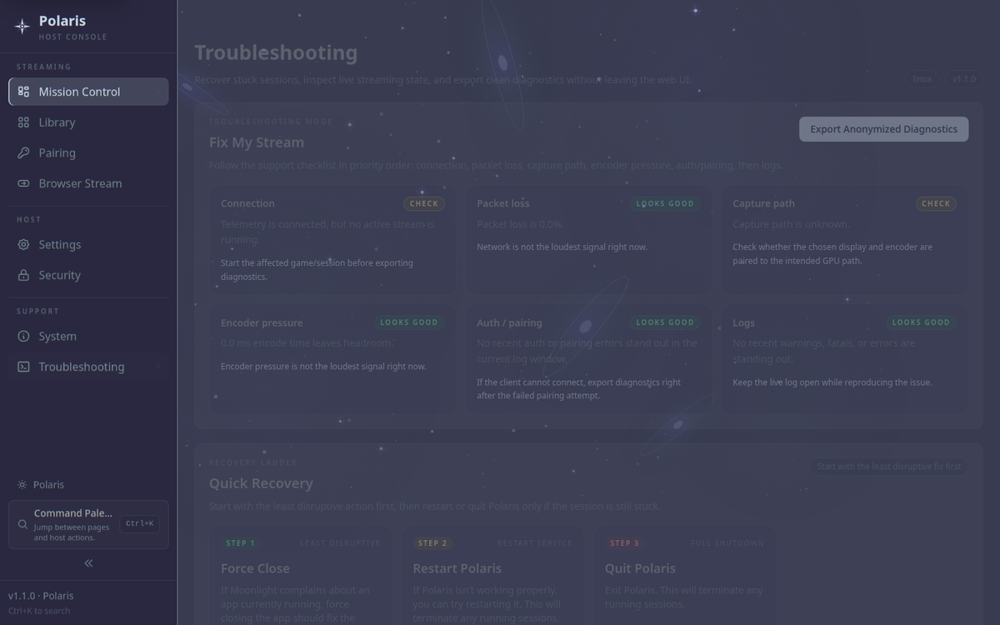
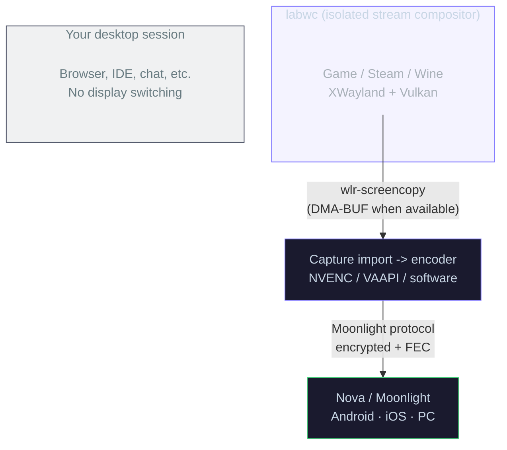

<div align="center">



# Polaris

**Self-hosted game streaming for Linux.**

Stream your PC games to any device on your network without wrecking your desktop layout.
Polaris combines an isolated compositor runtime, GPU-aware capture, and a dashboard that
shows the real capture path instead of leaving you guessing.

[](https://github.com/papi-ux/polaris/stargazers)
[](LICENSE)
[](https://github.com/papi-ux/polaris/releases/latest)

[Why Polaris](#why-polaris) · [Quick Start](#quick-start) · [Tour](#tour) · [Platform Status](#platform-status) · [Install Packages](#install-packages) · [Install from Source](#install-from-source) · [Client Apps](#client-apps) · [FAQ](#faq)

**Support**: [Issues](https://github.com/papi-ux/polaris/issues) · **Donate**: [Ko-fi](https://ko-fi.com/papiux) · [PayPal](https://www.paypal.com/donate/?hosted_button_id=KD9R5KLYF6GN4)

<br/>

<picture>
  <source media="(prefers-color-scheme: light)" srcset="docs/screenshots/polaris-showcase.gif" width="820" />
  <source media="(prefers-color-scheme: dark)" srcset="docs/screenshots/polaris-showcase-oled.gif" width="820" />
  
</picture>

</div>

> [!IMPORTANT]
> Polaris is Linux-first today. Fedora has a direct GitHub release RPM path, while Arch and Debian are still primarily source-build oriented. Windows is a future port rather than a supported target.

## Why Polaris

Sunshine and Apollo can drag your physical displays through mode switches, portal prompts, and layout corruption every time a client connects. If you stream games on KDE Wayland, you already know the failure mode: the stream works, but your desktop gets treated as disposable.

Polaris takes a different route. Games run inside a dedicated **[labwc](https://labwc.github.io)** compositor instead of your main session. Polaris prefers **GPU-native capture** when the stack supports it, can switch between invisible headless and visible windowed compositor modes to preserve the fast path, and exposes the **actual runtime path** in the dashboard so you can see what capture backend, transport, residency, and format are really in use.

### What Polaris gives you

- **Desktop-safe streaming**: no HDMI dummy plugs, no `kscreen-doctor` juggling, no physical display switching as part of the normal stream path.
- **Mission Control dashboard**: live preview, six real-time charts, GPU telemetry, quick controls, recording, and a `Runtime Path` card that exposes the session's real backend and capture transport.
- **Optional optimization guidance**: adaptive bitrate, per-device and per-game tuning suggestions via local or hosted models, and explicit visibility when the Linux stack falls back away from the GPU-native path.
- **Accurate cold-launch negotiation**: deferred headless encoder capabilities are primed and cached before first launch, so Main10 support is advertised correctly without needing a warm resume.
- **Better library and pairing UX**: Steam, Lutris, and Heroic import; SteamGridDB art; TOFU, QR, and PIN pairing flows.
- **Shared-session streaming**: multiple viewers can watch the same stream, with session quality tracking and feedback instead of a black box.

## Quick Start

```bash
git clone --recursive https://github.com/papi-ux/polaris.git
cd polaris
cmake -B build -DCMAKE_BUILD_TYPE=Release -DPOLARIS_ENABLE_CUDA=ON
cmake --build build -j$(nproc)
sudo cmake --install build
sudo polaris --setup-host
polaris
```

Open **https://localhost:47990**, create your password, and pair a client.

> [!NOTE]
> If you changed `port` in `~/.config/polaris/polaris.conf`, the web UI is available at `https://localhost:<port + 1>`. If you want background autostart instead of direct launch, enable the optional user service with `systemctl --user enable --now polaris`.
>
> Fedora users can skip the source build entirely with the release RPM in [Install Packages](#install-packages).

## Tour

### Mission Control

Polaris is built around a dashboard that answers the questions stream hosts usually have to reverse-engineer from logs: what runtime is active, what capture path is actually in use, how the encoder is behaving, and whether the system still has headroom.

<p align="center">
  <picture>
    
  </picture>
</p>

### Live Session View

When a stream is active, Polaris shifts from setup to live operations: preview, charts, recording controls, recommendations, and runtime-path telemetry are all visible in one place.

<p align="center">
  <picture>
    
  </picture>
</p>

### Library and Pairing

The rest of the product follows the same principle: fewer hidden states, fewer helper scripts, and less ceremony.

<table>
  <tr>
    <td width="50%" valign="top">
      <picture>
        
      </picture>
      <p><strong>Game library</strong><br/>Import from Steam, Lutris, and Heroic, attach art, organize categories, and tune per-game launch behavior.</p>
    </td>
    <td width="50%" valign="top">
      <picture>
        
      </picture>
      <p><strong>Pairing</strong><br/>Use TOFU on trusted LAN subnets, QR for Nova, or manual PIN pairing for standard Moonlight clients.</p>
    </td>
  </tr>
</table>

<details>
<summary><b>More screens</b></summary>

<table>
  <tr>
    <td width="50%" valign="top">
      <picture>
        <source media="(prefers-color-scheme: light)" srcset="docs/screenshots/configuration.png" width="100%" />
        <source media="(prefers-color-scheme: dark)" srcset="docs/screenshots/configuration-oled.png" width="100%" />
        
      </picture>
      <p><strong>Configuration</strong><br/>General, input, audio/video, network, AI, and encoder settings in one place.</p>
    </td>
    <td width="50%" valign="top">
      <picture>
        <source media="(prefers-color-scheme: light)" srcset="docs/screenshots/troubleshooting.png" width="100%" />
        <source media="(prefers-color-scheme: dark)" srcset="docs/screenshots/troubleshooting-oled.png" width="100%" />
        
      </picture>
      <p><strong>Troubleshooting</strong><br/>Inspect diagnostics without jumping between CLI tools, log snippets, and blind guesswork.</p>
    </td>
  </tr>
</table>

</details>

## How It Works

Polaris launches a dedicated compositor runtime for the stream, captures frames from that runtime instead of your desktop session, then routes those frames into the encoder path best suited to the hardware and current Linux stack.



<details>
<summary><b>Linux runtime notes</b></summary>

- `headless_mode` requests an invisible `labwc` session.
- `linux_prefer_gpu_native_capture=enabled` keeps the intent to prefer DMA-BUF and GPU-native capture, but Polaris will stay headless and surface SHM fallback explicitly on stacks where nested `labwc` DMA-BUF import is still unreliable.
- On deferred headless cage setups, Polaris primes encoder capabilities with a temporary runtime before launch negotiation, then caches a stable capability snapshot so HEVC/AV1 Main10 is visible on the first real launch.
- The dashboard and stream stats surface:
  requested headless mode, effective runtime mode, whether the GPU-native override is active, and the actual capture transport, residency, and format.
- `linux_capture_profile=enabled` logs p50 and p99 capture timings for dispatch, ingest, and total capture time, tagged by transport.
- Polaris now uses RealtimeKit on Linux when available, so thread-priority elevation can still succeed even if the user service inherits `RLIMIT_NICE=0` and `RLIMIT_RTPRIO=0`.
- Current Linux behavior is pragmatic rather than magical: preserve GPU-native capture when the stack allows it, and make SHM fallback obvious when it does not.

</details>

<details>
<summary><b>Session lifecycle details</b></summary>

- MangoHud environment is isolated from the compositor, then re-injected selectively into the game launch command.
- Steam Big Picture and Steam/Proton helper paths are treated conservatively because MangoHud can crash Proton helpers and leave the session black-screened.
- D-Bus lock screen inhibition prevents idle lock during active streaming.
- XWayland persistence improves Proton and Wine game compatibility.
- The end button kills `labwc` and its child process tree cleanly.
- Encoder capabilities are probed and cached with driver/topology metadata so deferred headless launches can advertise accurate codec support before the session-time reprobe.
- Multi-viewer support currently allows up to 8 simultaneous viewers on one stream.

</details>

<details>
<summary><b>Polaris v1 REST API</b></summary>

Endpoints live at `https://localhost:47984/polaris/v1/` and are authenticated with Moonlight pairing certificates.

| Method | Endpoint | Description |
|--------|----------|-------------|
| `GET` | `/capabilities` | Server features, encoding support, capture backend |
| `GET` | `/session/status` | Active session state, also available as SSE |
| `GET` | `/games` | Game library with metadata, genres, and cover art |
| `POST` | `/session/launch` | Launch a game, including client display dimensions |
| `POST` | `/session/bitrate` | Adjust bitrate mid-stream |
| `POST` | `/session/report` | Submit a client quality report after disconnect |
| `GET` | `/optimize` | Fetch AI-recommended settings for a device and game |
| `POST` | `/games/{id}/mangohud` | Toggle MangoHud per game |

</details>

## Platform Status

| Platform | Status | Notes |
|---|---|---|
| Linux | Primary target | Main development focus today |
| Fedora | Works today | Native package path exists today |
| Arch Linux | In progress | Source builds work; CI validates both the Arch build and generated `PKGBUILD` path |
| Debian | In progress | Source builds work; packaging is still being aligned with the Linux flow |
| Windows | Future port | Not a supported Polaris target today |

> [!NOTE]
> CI coverage is practical rather than exhaustive: Ubuntu validates the shared Linux build path, while Arch validates both the native build and generated `PKGBUILD` flow. The Arch job also uploads generated package files and any package outputs as artifacts for inspection.

## Install Packages

### Fedora RPM

Use the release RPM if you want the shortest install path on Fedora:

```bash
sudo dnf install https://github.com/papi-ux/polaris/releases/latest/download/Polaris-fedora42-x86_64.rpm
sudo polaris --setup-host
polaris
```

Optional autostart:

```bash
systemctl --user enable --now polaris
```

The published release RPM is currently built on Fedora 42 x86_64. If you want a local build, need a different distro, or want to regenerate packages yourself, use the source path below.

## Install from Source

Use this path on Arch, Debian, development machines, or whenever you want a local/custom build.

### Core dependencies

| Package | Why it matters |
|---------|----------------|
| CMake 3.25+ | Build system |
| Boost 1.80+ | Core libraries |
| OpenSSL | TLS and pairing crypto |
| libevdev | Virtual input handling |
| PipeWire | Audio capture |
| wayland-client | Compositor integration |
| CUDA toolkit | NVENC hardware encoding |
| Node.js 18+ | Frontend build |
| labwc | Isolated stream compositor |

### Distro packages

<details>
<summary><b>Fedora</b></summary>

```bash
sudo dnf install cmake gcc-c++ boost-devel openssl-devel libevdev-devel \
  pipewire-devel wayland-devel libdrm-devel libcap-devel \
  mesa-libEGL-devel mesa-libGL-devel cuda-toolkit nodejs npm labwc
```

</details>

<details>
<summary><b>Arch</b></summary>

```bash
sudo pacman -S cmake boost openssl libevdev pipewire wayland \
  libdrm libcap mesa cuda nodejs npm labwc
```

</details>

### Build

```bash
git clone --recursive https://github.com/papi-ux/polaris.git
cd polaris
cmake -B build -DCMAKE_BUILD_TYPE=Release -DPOLARIS_ENABLE_CUDA=ON
cmake --build build -j$(nproc)
```

### Install

```bash
# Installs the binary, web UI, user service unit, desktop entry, icons, and host-setup assets
sudo cmake --install build
```

### Host setup

```bash
# Virtual input and controller support
sudo polaris --setup-host

# Only if you need DRM/KMS capture
sudo polaris --setup-host --enable-kms
```

### Run

```bash
polaris
```

Open **https://localhost:47990** by default. If you changed `port` in `~/.config/polaris/polaris.conf`, the web UI is available at `https://localhost:<port + 1>`.

### Optional autostart

```bash
systemctl --user enable --now polaris
```

<details>
<summary><b>Build an RPM package</b></summary>

```bash
cpack --config build/CPackConfig.cmake -G RPM
sudo rpm -i build/cpack_artifacts/Polaris.rpm
```

</details>

> [!WARNING]
> Only grant `cap_sys_admin` when you actually need DRM/KMS capture. Polaris runs fine without it on the default compositor and portal paths.

## Configuration

Config file: `~/.config/polaris/polaris.conf`

```ini
# Headless mode (recommended)
headless_mode = enabled
linux_use_cage_compositor = true
linux_prefer_gpu_native_capture = enabled

# TOFU auto-pairing for your LAN
trusted_subnets = ["10.0.0.0/24"]

# Encoding
encoder = nvenc

# AI Optimizer
ai_enabled = enabled
ai_provider = openai            # anthropic | openai | gemini | local
ai_model = gpt-5.4-mini
ai_auth_mode = api_key          # subscription for Claude CLI, none for local no-auth endpoints
ai_api_key = sk-proj-...

# Adaptive bitrate
adaptive_bitrate_enabled = enabled

# Multi-viewer (default: 2, max: 8)
max_sessions = 2
```

> [!TIP]
> In headless mode you do not need KDE window rules, `kscreen-doctor` scripts, HDMI dummy plugs, or manual portal setup. Turn on the isolated compositor path and let Polaris manage the runtime itself.

<details>
<summary><b>AI provider examples</b></summary>

Use the AI tab in the web UI if you want a draft connection test before saving. If you prefer direct config edits, these are the working shapes Polaris expects.

**Claude / Anthropic**

```ini
ai_enabled = enabled
ai_provider = anthropic
ai_model = claude-haiku-4-5-20251001
ai_auth_mode = subscription
# Legacy fallback also works:
# ai_use_subscription = enabled
```

**OpenAI**

```ini
ai_enabled = enabled
ai_provider = openai
ai_model = gpt-5.4-mini
ai_auth_mode = api_key
ai_api_key = sk-proj-...
```

**Gemini**

```ini
ai_enabled = enabled
ai_provider = gemini
ai_model = gemini-2.5-flash
ai_auth_mode = api_key
ai_api_key = YOUR_GEMINI_KEY
```

**Ollama**

```ini
ai_enabled = enabled
ai_provider = local
ai_model = gpt-oss
ai_auth_mode = none
ai_base_url = http://127.0.0.1:11434/v1
```

**LM Studio**

```ini
ai_enabled = enabled
ai_provider = local
ai_model = qwen3-8b
ai_auth_mode = none
ai_base_url = http://127.0.0.1:1234/v1
```

</details>

<details>
<summary><b>All options</b></summary>

| Key | Default | Description |
|-----|---------|-------------|
| `headless_mode` | `disabled` | Request an invisible `labwc` runtime |
| `linux_use_cage_compositor` | `false` | Enable the isolated `labwc` capture runtime |
| `linux_prefer_gpu_native_capture` | `enabled` | Prefer DMA-BUF and GPU-native capture; Polaris may still stay headless and use SHM when nested `labwc` DMA-BUF is not reliable on the current stack |
| `trusted_subnets` | `[]` | CIDR blocks that enable TOFU auto-pairing |
| `encoder` | `nvenc` | Encoder: `nvenc`, `vaapi`, `software` |
| `ai_enabled` | `disabled` | Enable AI-assisted stream optimization |
| `ai_provider` | `anthropic` | AI backend: `anthropic`, `openai`, `gemini`, or `local` |
| `ai_model` | provider default | Model identifier sent to the selected provider |
| `ai_auth_mode` | provider default | Auth mode: `api_key`, `subscription`, or `none` |
| `ai_api_key` | - | Provider API key for `api_key` mode |
| `ai_base_url` | provider default | Override the provider endpoint, useful for local servers |
| `ai_use_subscription` | `disabled` | Legacy Anthropic toggle; equivalent to `ai_auth_mode = subscription` when `ai_auth_mode` is unset |
| `adaptive_bitrate_enabled` | `disabled` | Enable mid-stream bitrate adjustment |
| `max_sessions` | `2` | Simultaneous viewers, `0` means unlimited and the current hard max is 8 |
| `enable_pairing` | `enabled` | Accept new client pairing |
| `enable_discovery` | `enabled` | Advertise over mDNS |
| `stream_audio` | `enabled` | Enable audio capture |
| `steamgriddb_api_key` | - | Fetch cover art for non-Steam games |

</details>

## Client Apps

<div align="center">

### [Nova](https://github.com/papi-ux/nova)

The Polaris-aware Android client: TOFU auto-pairing, interactive HUD, quality presets,
gyro aiming, audio haptics, and Material You styling.

[](https://apps.obtainium.imranr.dev/redirect?r=obtainium://app/%7B%22id%22%3A%20%22com.papi.nova%22%2C%20%22url%22%3A%20%22https%3A//github.com/papi-ux/nova%22%2C%20%22author%22%3A%20%22papi-ux%22%2C%20%22name%22%3A%20%22Nova%22%7D)
&nbsp;
[](https://github.com/papi-ux/nova/releases/latest)

Also compatible with standard [Moonlight](https://moonlight-stream.org) clients on any platform.

</div>

## FAQ

<details>
<summary><b>Does Polaris work with Moonlight on iOS, PC, and macOS?</b></summary>

Yes. Polaris speaks the Moonlight protocol. Any Moonlight client can connect and stream. Polaris-specific features such as optimization suggestions, TOFU pairing, and session-quality reporting require [Nova](https://github.com/papi-ux/nova) on Android.

</details>

<details>
<summary><b>Do I need an NVIDIA GPU?</b></summary>

No, but NVENC is the primary and most-tested encoder path today. VAAPI and software encoding are supported, but the current Linux compositor and DMA-BUF pipeline are tuned most heavily around NVIDIA.

</details>

<details>
<summary><b>Does headless mode work on Hyprland, Sway, or GNOME?</b></summary>

The headless `labwc` compositor is display-server agnostic because it creates its own Wayland instance. Polaris has been tested most heavily on KDE Plasma Wayland, but the model should work on other Wayland sessions as well. X11 sessions can still use `x11grab` as a fallback and do not get the same headless behavior.

</details>

<details>
<summary><b>My KDE display layout gets corrupted after streaming</b></summary>

That problem is the reason Polaris exists. Enable headless mode with `headless_mode = enabled` and `linux_use_cage_compositor = true`, and Polaris will stop treating your physical displays as part of the stream path. Keep `linux_prefer_gpu_native_capture = enabled` so Polaris can take the GPU-native path on stacks that support it, but expect current NVIDIA + nested `labwc` setups to remain headless and report SHM fallback in the runtime stats.

</details>

<details>
<summary><b>How does the AI optimizer work, and does it phone home?</b></summary>

The AI optimizer is optional and disabled by default. When enabled, it sends device specs, app metadata, and recent session history to the provider you configure: Anthropic, OpenAI, Gemini, or a local OpenAI-compatible endpoint such as Ollama or LM Studio. Results are cached locally for 7 days per provider and model. If you use a local endpoint, the traffic stays on-box unless that local server is itself configured to proxy elsewhere.

</details>

<details>
<summary><b>Can multiple people watch the same stream?</b></summary>

Yes. Set `max_sessions = N` in your config. The current default is 2 and the current hard max is 8. Viewers share the same encoded stream output, so GPU load does not scale linearly with viewer count.

</details>

<details>
<summary><b>Can Polaris stream 10-bit to an SDR handheld screen?</b></summary>

Yes, if the client explicitly requests a 10-bit path and the active encoder/runtime support Main10. This is most useful with Nova: enabling HDR in Nova can request a 10-bit SDR stream even when the handheld panel itself is not HDR10-capable. On a working headless NVENC fast path, Polaris will show `Client dynamicRange: 1`, `target_format=p010`, and `capture_transport=dmabuf` in the logs or runtime stats.

</details>

<details>
<summary><b>How do I pair a new device?</b></summary>

You have three paths: **TOFU** on trusted LAN subnets, **QR** pairing for Nova, or a standard **manual PIN** flow. The first paired device gets full permissions; later devices default to view-only unless you promote them.

</details>

<details>
<summary><b>Steam Big Picture shows a black screen or tiny window</b></summary>

First clear Steam's HTML cache with `rm -rf ~/.local/share/Steam/config/htmlcache/`. Steam can cache a broken geometry from a previous session and then render inside the compositor at unusable dimensions.

If the session still comes up black, disable MangoHud for Steam Big Picture and Steam/Proton titles. Polaris now treats those launch paths conservatively because MangoHud can crash Proton helpers before the stream ever gets a usable frame.

</details>

<details>
<summary><b>I see `Missing Wayland wire for wlr-export-dmabuf` or SHM screencopy warnings</b></summary>

Those messages are expected on some headless `labwc` paths. They mean Polaris is using screencopy with SHM-backed frames instead of a zero-copy DMA-BUF handoff. That is slower than the ideal path, but it is still a valid and supported runtime. Check the dashboard or stream stats for the actual active path: `capture_transport`, `frame_residency`, and `frame_format`.

</details>

## Contributing

Contributions are welcome: bug fixes, features, documentation, translations, and packaging work.

1. Fork the repo and branch from `master`.
2. Make your changes and test them locally.
3. For frontend changes, run `npm run build` in the repo root.
4. Open a pull request that explains what changed and why.

> [!NOTE]
> The web UI lives in `src_assets/common/assets/web/` and uses Vue 3 with Tailwind CSS v4. The backend lives in `src/`. CMake builds both together.

## Donate

I build Polaris and Nova in my spare time because Linux game streaming deserves better tooling. If the project is useful to you, donations help keep development moving.

[](https://ko-fi.com/papiux)
&nbsp;
[](https://www.paypal.com/donate/?hosted_button_id=KD9R5KLYF6GN4)

## License

Polaris is licensed under the **GNU General Public License v3.0**. See [LICENSE](LICENSE) for the full text.

Polaris is a fork of [Apollo](https://github.com/ClassicOldSong/Apollo) by ClassicOldSong, which is itself a fork of [Sunshine](https://github.com/LizardByte/Sunshine) by LizardByte. Both are GPLv3. The streaming protocol remains compatible with [Moonlight](https://moonlight-stream.org) clients.
