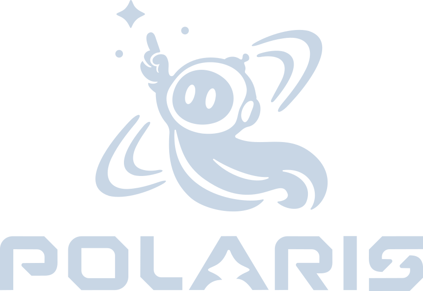
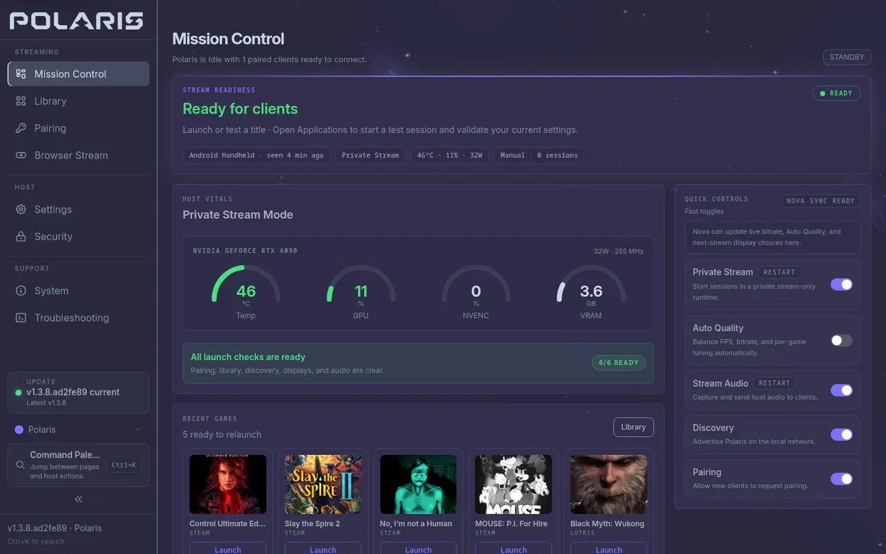
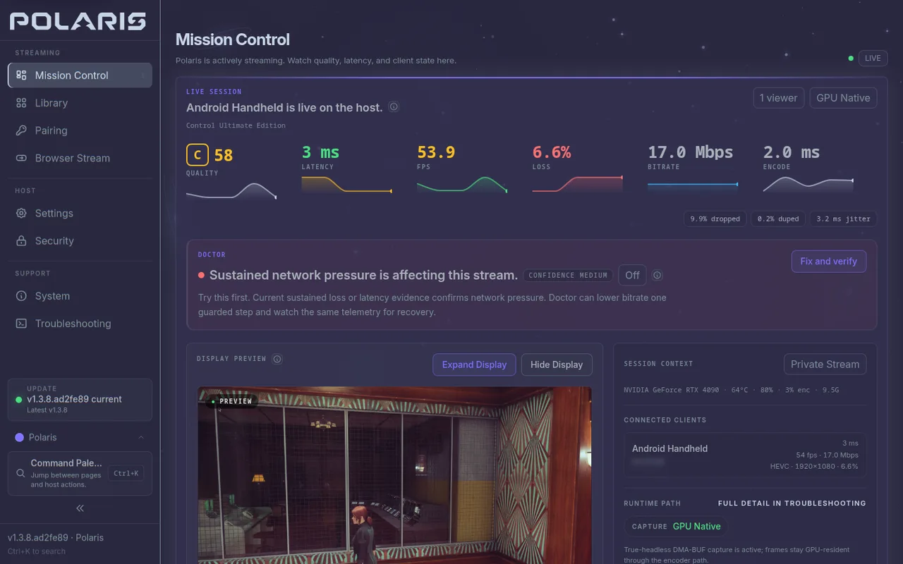
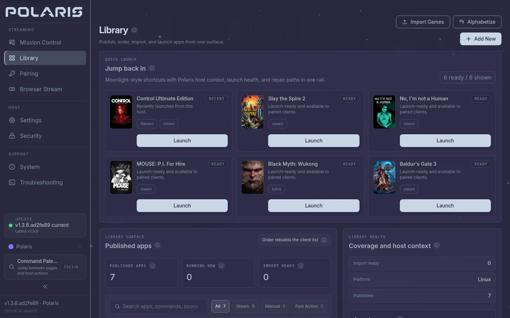

<div align="center">



**Linux-only, self-hosted game streaming that keeps the stream off your desktop.**

Polaris launches games in an isolated Linux compositor, streams them to Nova or
Moonlight-compatible clients, and explains the active capture, encoder, client,
and runtime path in one web console.

[](https://github.com/papi-ux/polaris/stargazers)
[](LICENSE)
[](https://github.com/papi-ux/polaris/releases/latest)

[**Explore Polaris**](https://papi-ux.com/polaris/) ·
[**Download**](https://github.com/papi-ux/polaris/releases/latest) ·
[Quick start](https://papi-ux.com/docs/quickstart/) ·
[Compatibility](https://papi-ux.com/docs/compatibility/)

</div>

> [!IMPORTANT]
> Polaris is a Linux host application by design. Windows and macOS host ports
> are not planned; Nova and standard Moonlight clients can connect from their
> supported platforms.



## Why Polaris

- **A private streaming desktop.** Headless Stream runs a game in its own
  compositor instead of changing your physical monitor layout.
- **Operational truth, not a mystery box.** Mission Control shows the chosen
  runtime, capture path, encoder, viewers, latency, loss, and Doctor guidance.
- **A client-aware launch model.** Nova can present available display modes,
  session ownership, safe disconnects, and host-backed tuning before and during
  play.
- **Local-first and open.** Pairing state, permissions, library data, and core
  streaming remain on your host. Optional AI features use only the provider you
  configure.

## How isolation works

1. **Choose a game.** Launch from Polaris, Nova, or a compatible Moonlight
   client.
2. **Create a stream-only runtime.** Polaris starts an isolated compositor and
   resolves the requested display, capture, and encoder path for that session.
3. **Observe and recover.** Mission Control reports what actually happened;
   Doctor suggests bounded corrections when live evidence needs attention.

Read the [runtime guide](https://papi-ux.com/docs/runtime/) for the detailed
Headless Stream, virtual-display, and desktop-mirroring behavior.

## Ready, live, and back to the library

The same Mission Control surface changes from an idle host with a paired client
to an active stream with live telemetry, Doctor status, and the resolved GPU
capture path.



The Library keeps launch health and source context beside the artwork. Control
Ultimate Edition leads this representative Aurora capture.



See motion and compare Portable Chrome, Console OLED, Miami Nebula, and High
Contrast in the [website theme gallery](https://papi-ux.com/polaris/#themes).

Every capture above and across [papi-ux.com](https://papi-ux.com/polaris/) comes from the tagged public release; the [pixel-level provenance manifest](https://papi-ux.com/images/products/showcase-v1.3.8-v1.3.6-provenance.json) ships with the site.

## Install and start a first stream

Use an official package from the [latest GitHub
release](https://github.com/papi-ux/polaris/releases/latest), then perform the
explicit host setup:

```bash
sudo -H polaris --setup-host
polaris
```

Open `https://localhost:47990`, create the web account, pair a client, and launch
a title. The [quick-start guide](https://papi-ux.com/docs/quickstart/) contains
the current Fedora, Arch, SteamOS, Ubuntu, Bazzite, openSUSE, and source paths.
Only use `polaris --setup-host --enable-kms` when the guide says your DRM/KMS
capture path needs it.

## Clients and compatibility

[Nova](https://papi-ux.com/nova/) is the enhanced Android client. It adds a
host-backed Library, Play Setup, Private Stream choices, Command Center,
NovaHUD, session ownership, and tuning provenance. Install it from the [latest
Nova release](https://github.com/papi-ux/nova/releases/latest).

Standard Moonlight-compatible clients remain supported for pairing, browsing,
launching, input, and streaming. Features that depend on Polaris-specific host
metadata are naturally limited there. Check the maintained [compatibility
guide](https://papi-ux.com/docs/compatibility/) before choosing a distro, GPU,
capture path, HDR mode, or experimental Browser Stream setup.

## Documentation and project links

- [Documentation](https://papi-ux.com/docs/) · [FAQ](https://papi-ux.com/docs/faq/) · [Runtime](https://papi-ux.com/docs/runtime/)
- [Roadmap](https://papi-ux.com/docs/roadmap/) · [Website changelog](https://papi-ux.com/docs/changelog/) · [GitHub changelog](docs/changelog.md)
- [Releases](https://github.com/papi-ux/polaris/releases) · [Issues](https://github.com/papi-ux/polaris/issues) · [Discussions](https://github.com/papi-ux/polaris/discussions)
- [Security policy](SECURITY.md) · [Contributing](.github/CONTRIBUTING.md) · [Source](https://github.com/papi-ux/polaris)

## Acknowledgments

Polaris builds on the Apollo and Sunshine host lineage and stays protocol-compatible with the wider Moonlight ecosystem. Thanks to those maintainers and communities for the foundation.

## AI Transparency

Polaris is a maintainer-led project. I use AI-assisted tools as research,
debugging, comparison, and drafting aids, especially when validating unfamiliar
Linux compositor, packaging, and client behavior.

Those tools do not decide what Polaris is or what ships. I review changes,
test every aspect, and own the final decisions around validation,
trust boundaries, and release quality.

## Contributing

Contributions are welcome, especially focused fixes, docs, translations, packaging improvements, real-hardware testing, and careful feature work. Polaris is still a small maintainer-led project, so the easiest pull requests to review are the ones that explain the problem clearly, keep the change scoped, and say what was tested on Linux. See [CONTRIBUTING](.github/CONTRIBUTING.md) for the full workflow.

## License

Polaris is free and open-source software licensed under the [GNU General Public
License v3.0](LICENSE).
