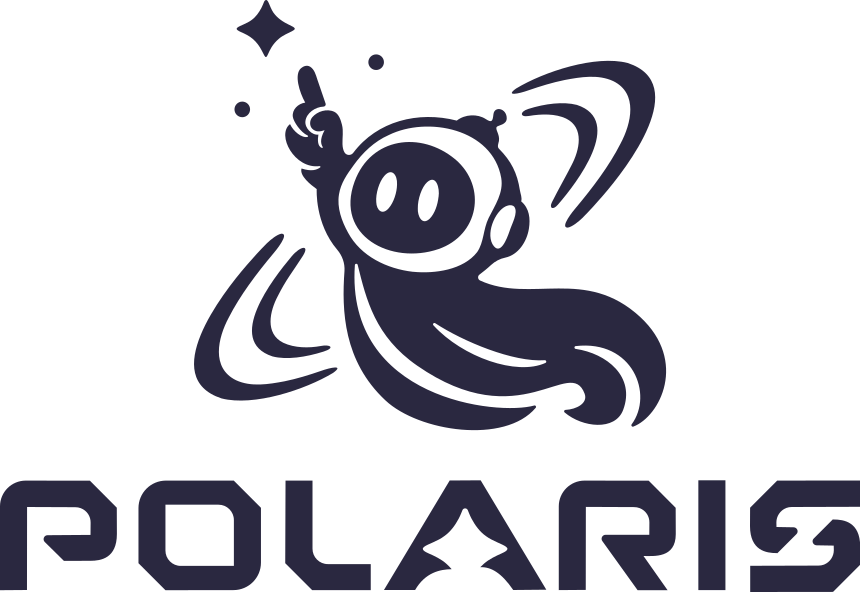
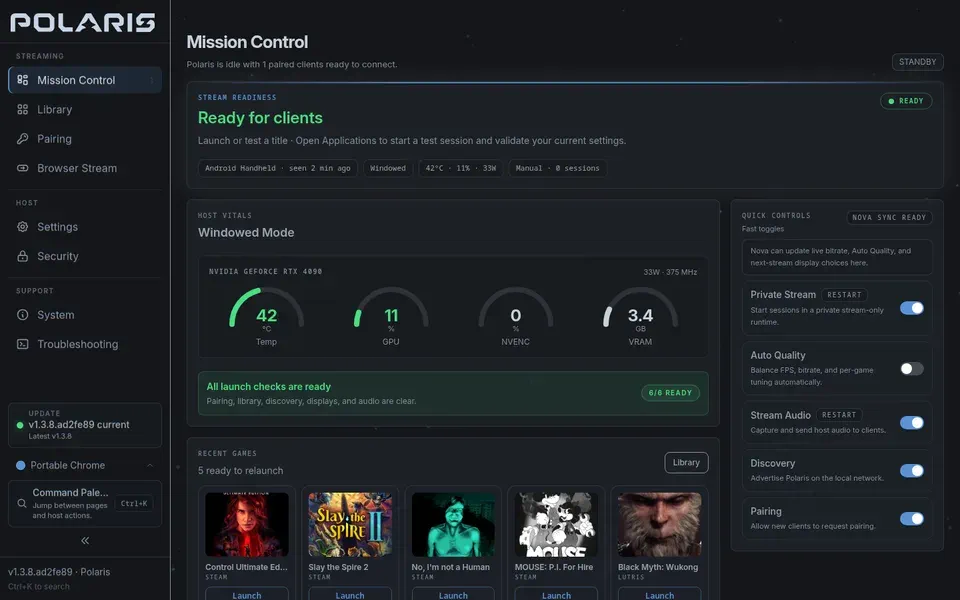

<div align="center">

<picture>
  <source media="(prefers-color-scheme: dark)" srcset="docs/screenshots/Polaris_fulllogo_2.svg">
  
</picture>

**Linux game streaming that answers to you.**

Polaris turns a Linux gaming PC or a Steam Deck into a modern, self-hosted
streaming home for Nova, Moonlight, and other compatible clients. Choose whether
a session uses a private compositor, a virtual display, your desktop, or the
Steam Game Mode screen, then see the active capture, encoder, client, and
runtime path in one web console.

[](https://github.com/papi-ux/polaris/stargazers)
[](https://matrix.to/#/#papi-ux:papi-ux.com)
[](LICENSE)
[](https://github.com/papi-ux/polaris/releases/latest)

[**Explore Polaris**](https://papi-ux.com/polaris/) ·
[**Download**](https://github.com/papi-ux/polaris/releases/latest) ·
[Join the Matrix community](https://matrix.to/#/#papi-ux:papi-ux.com) ·
[Quick start](https://papi-ux.com/docs/quickstart/) ·
[Compatibility](https://papi-ux.com/docs/compatibility/)

</div>


> [!IMPORTANT]
> Polaris is a Linux host application by design. Windows and macOS host ports
> are not planned; Nova and standard Moonlight clients can connect from their
> supported platforms.


## Built for the whole player loop

Polaris is the matched host for Nova. Together they make the whole player loop
explicit:

- **Where games run is a real choice.** Private Stream, Gamescope Stream, Host
  Virtual Display, Headless Dongle, and Mirror Desktop are described by their
  display and privacy impact, unavailable modes fail closed, and the displays
  Polaris creates for a stream go up to 240 FPS.
- **Streams straight from Steam Game Mode.** A Steam Deck, or any PC running a
  gamescope Steam session, streams its Game Mode screen. A Steam title launched
  from Nova opens in Game Mode, a controller arrives as a DualSense, touch lands
  where you aim it, and End Session closes only the title the stream opened.
  Proven on a Steam Deck OLED; the
  [handhelds guide](https://papi-ux.com/docs/handhelds/) keeps Polaris running
  across a switch between Desktop Mode and Game Mode.
- **Spaces, an early preview.** Each player gets their own sign-in, library and
  saves on one PC, in Steam, in Heroic Games Launcher with their Epic, GOG and
  Amazon games, or in Lutris. A Space is chosen from Nova with the same words on
  every surface and a reason whenever it cannot start, its runtime downloads
  from Host Setup, and on NVIDIA it borrows this PC's own driver, so a driver
  update no longer strands it. One active Space at a time; the
  [Spaces guide](https://papi-ux.com/docs/spaces/) and
  [Spaces or regular streaming](https://papi-ux.com/docs/spaces-or-regular/)
  say what that means for you.
- **Anyone can watch.** A second device can watch the stream that is running,
  whatever its own resolution. The host says up front what there is to watch, so
  Nova asks for exactly that stream; Moonlight still asks for the stream's mode.
- **A library that fills from a folder of ROMs.** Import a ROM folder once and
  rescan for new games. Eden, Dolphin, Cemu, DuckStation, PCSX2, PPSSPP and
  mGBA are presets, covers come from your folders, ES-DE or RetroArch, and the
  card names what an emulator still lacks before a game boots. The
  [emulators guide](https://papi-ux.com/docs/emulators/) covers the whole path.
- **Refusals say why.** A refused launch carries what went wrong and the one
  change that fixes it, with a code Nova shows, instead of error 503.
- **Doctor acts only when it can prove the step is safe.** It can make one
  reversible same-stream bitrate change, verify the encoder and fresh evidence,
  and restore the previous target when verification fails. Other findings stay
  read-only guidance, including the forecast, before any stream, of when capture
  on this host would copy frames through system memory and why.
- **Launches are deterministic.** Auto, Quality, High FPS, and Stability resolve
  into one app- and topology-bound envelope that Nova sends back unchanged.
- **The Library keeps identity intact.** Native and Flatpak Heroic GOG/Epic
  imports retain their runner and installation identity, while built-in utility
  entries keep their shipped artwork unless the player chooses a manual match.

Read the [changelog](docs/changelog.md) for the release-by-release change and
validation record.

## Why Polaris

<table>
<tr>
<td width="50%" valign="top"><br>
<b>A private streaming desktop.</b> Headless Stream runs a game in its own compositor instead of changing your physical monitor layout.</td>
<td width="50%" valign="top"><br>
<b>Operational truth, not a mystery box.</b> Mission Control shows the chosen runtime, capture path, encoder, viewers, latency, loss, and Doctor guidance.</td>
</tr>
<tr>
<td valign="top"><br>
<b>A client-aware launch model.</b> Nova can present available display modes, session ownership, safe disconnects, and host-backed tuning before and during play.</td>
<td valign="top"><br>
<b>Local-first and open.</b> Pairing state, permissions, library data, and core streaming remain on your host. Optional AI features use only the provider you configure.</td>
</tr>
</table>

## How isolation works

1. **Choose a game.** Launch from Polaris, Nova, or a compatible Moonlight
   client.
2. **Resolve where this session runs.** Private and Gamescope modes get a
   session-owned compositor; Host Virtual Display gets an extra output; Mirror
   Desktop deliberately uses the physical desktop. A Space runs its own Steam
   in a container, chosen per device. Polaris validates the matching capture
   and encoder path before admitting the stream.
3. **Observe and recover.** Mission Control reports what actually happened;
   Doctor suggests bounded corrections when live evidence needs attention.

Read the [runtime guide](https://papi-ux.com/docs/runtime/) for the detailed
Headless Stream, virtual-display, and desktop-mirroring behavior.

##  Ready, live, and back to the library

The same Mission Control surface changes from an idle host with a paired client
to an active stream with live telemetry, Doctor status, and the resolved GPU
capture path.


The Library keeps launch health and source context beside the artwork. Control
Ultimate Edition leads this representative Aurora capture.


<p align="center">
  <a href="https://papi-ux.com/polaris/#themes"></a><br>
  <a href="https://papi-ux.com/polaris/#themes"></a><br>
  <sub><a href="https://papi-ux.com/polaris/#themes">Compare every theme in the website gallery</a></sub>
</p>

Every capture above and across [papi-ux.com](https://papi-ux.com/polaris/) comes from the tagged public release; the [pixel-level provenance manifest](https://papi-ux.com/images/products/showcase-v1.3.8-v1.3.6-provenance.json) ships with the site.


## Install and start a first stream

Use an official package from the [latest GitHub
release](https://github.com/papi-ux/polaris/releases/latest), then perform the
explicit host setup. On Bazzite, follow the [RPM installation guide](docs/bazzite.md)
and reboot into the staged deployment before setup:

```bash
sudo -H polaris --setup-host
polaris
```

**Fresh install:** open `https://localhost:47990/#/welcome` and create the web
account. **Upgrade or reinstall:** open `https://localhost:47990/#/login` and
use the existing account; package operations intentionally preserve credentials,
pairing keys, settings, and the library under `~/.config/polaris`. The
[quick-start guide](https://papi-ux.com/docs/quickstart/) contains the current
Fedora, Arch, SteamOS, Ubuntu, Bazzite, openSUSE, and source paths, and on a
Steam Deck the [SteamOS guide](https://papi-ux.com/docs/steamos/) also keeps
Polaris running in Game Mode. Only use
`polaris --setup-host --enable-kms` when the guide says your DRM/KMS capture path
needs it.

## Clients and compatibility

[Nova](https://papi-ux.com/nova/) is the enhanced client for Android, and now
for Steam Deck as an Alpha. It adds a host-backed Library, the Space chooser,
Play Setup, Private Stream choices, Command Center, NovaHUD, session ownership,
and tuning provenance. Install it from the [latest Nova
release](https://github.com/papi-ux/nova/releases/latest), where the Steam Deck
Alpha is a Flatpak bundle beside the Android APKs.

Standard Moonlight-compatible clients remain supported for pairing, browsing,
launching, input, and streaming. Features that depend on Polaris-specific host
metadata are naturally limited there. Check the maintained [compatibility
guide](https://papi-ux.com/docs/compatibility/) before choosing a distro, GPU,
capture path, HDR mode, or experimental Browser Stream setup.

Newly paired clients receive **Game Control** by default: enough access to browse,
launch, and play, without clipboard, file-transfer, or server-command permissions.
Existing clients keep their saved access until it is changed under **Devices**.


## Documentation and project links

- [Documentation](https://papi-ux.com/docs/) · [Spaces](https://papi-ux.com/docs/spaces/) · [Emulators](https://papi-ux.com/docs/emulators/) · [Play with Moonlight](https://papi-ux.com/docs/moonlight/) · [Launch modes](https://papi-ux.com/docs/launch-modes/) · [Doctor](https://papi-ux.com/docs/doctor/) · [FAQ](https://papi-ux.com/docs/faq/)
- [Roadmap](https://papi-ux.com/docs/roadmap/) · [Website changelog](https://papi-ux.com/docs/changelog/) · [GitHub changelog](docs/changelog.md)
- [Matrix community](https://matrix.to/#/#papi-ux:papi-ux.com) · [Releases](https://github.com/papi-ux/polaris/releases) · [Issues](https://github.com/papi-ux/polaris/issues) · [Discussions](https://github.com/papi-ux/polaris/discussions)
- [Security policy](SECURITY.md) · [Contributing](.github/CONTRIBUTING.md) · [Source](https://github.com/papi-ux/polaris)

## Acknowledgments

Polaris builds on the Apollo and Sunshine host lineage and stays protocol-compatible with the wider Moonlight ecosystem. Thanks to those maintainers and communities for the foundation.

## AI Transparency

Polaris is a maintainer-led project. I use AI-assisted tools as research,
debugging, comparison, and drafting aids, especially when validating unfamiliar
Linux compositor, packaging, and client behavior.

Those tools do not decide what Polaris is or what ships. I review changes,
test every aspect, and own the final decisions around validation,
trust boundaries, and release quality.

## Contributing

Contributions are welcome, especially focused fixes, docs, translations, packaging improvements, real-hardware testing, and careful feature work. Polaris is still a small maintainer-led project, so the easiest pull requests to review are the ones that explain the problem clearly, keep the change scoped, and say what was tested on Linux. See [CONTRIBUTING](.github/CONTRIBUTING.md) for the full workflow.

## License

Polaris is free and open-source software licensed under the [GNU General Public
License v3.0](LICENSE).

<div align="center">


<picture>
  <source media="(prefers-color-scheme: dark)" srcset="docs/screenshots/polaris-icon-darkmode.svg">
  
</picture>

<sub>[Website](https://papi-ux.com/polaris/) · [Matrix](https://matrix.to/#/#papi-ux:papi-ux.com) · [Documentation](https://papi-ux.com/docs/) · [Releases](https://github.com/papi-ux/polaris/releases) · [Security](SECURITY.md)</sub>

</div>
