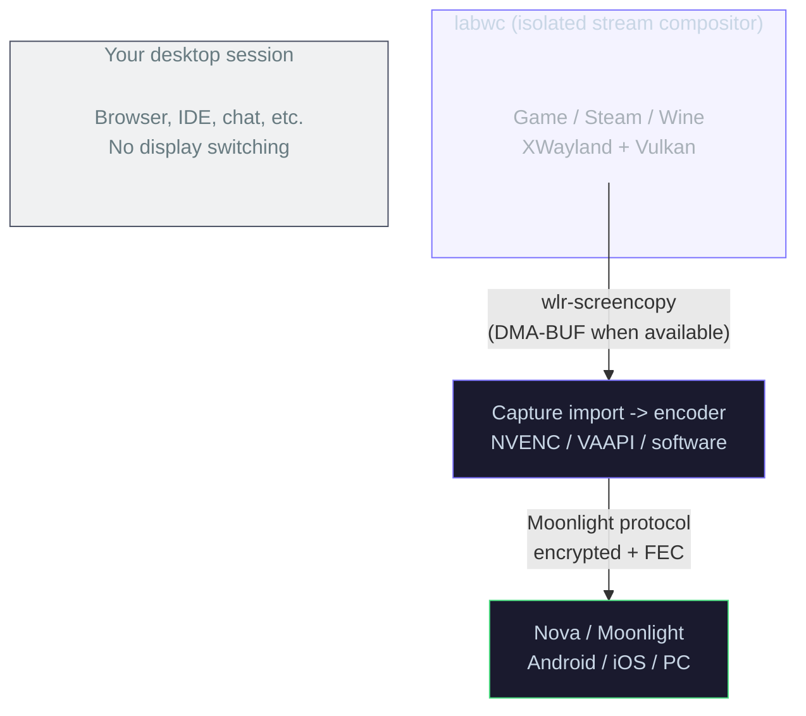

# Runtime and Streaming Model

Polaris is built around a stream runtime that is separate from your normal desktop session. The default Linux recommendation is Headless Stream: games launch inside a private `labwc` Wayland compositor, Polaris captures that compositor, and your KDE, GNOME, or wlroots desktop keeps its layout and display state.

Use this page when you want the technical model behind the README, runtime dashboard, troubleshooting logs, or launch behavior.

## Stream Runtime

Headless Stream is controlled by these settings:

```ini
headless_mode = enabled
linux_use_cage_compositor = enabled
linux_prefer_gpu_native_capture = disabled
```

- `headless_mode` requests a stream-only session instead of the visible desktop.
- `linux_use_cage_compositor` routes launched apps into Polaris' private Wayland compositor.
- `linux_prefer_gpu_native_capture = disabled` keeps the conservative Headless Stream path as the first validation path. Enable it only when testing a stack where you intentionally want to prefer DMA-BUF or another GPU-native capture path.

The private runtime is intentionally isolated. Steam, Wine, XWayland clients, and game launches should stay inside the stream compositor instead of bouncing back to the host desktop.



## Capture and Encode

Polaris captures the active stream output, imports frames into the best available encoder path, and reports the real path in the dashboard and logs.

Important runtime fields:

| Field | What it tells you |
|---|---|
| Requested mode | What the client or app launch asked for |
| Effective mode | What Polaris actually started |
| Capture transport | The active capture path, such as DMA-BUF or SHM fallback |
| Frame residency | Whether frames stay on GPU or move through system memory |
| Frame format | The captured pixel format |
| Encoder | The active backend, such as NVENC, VAAPI, or software |

Deferred headless encoder capabilities are primed before first launch negotiation so Main10 support is advertised correctly on the first real launch. On Linux, Polaris uses RealtimeKit when available so thread-priority elevation can still succeed when the user service inherits conservative limits.

## Session Lifecycle

Polaris tracks owner and viewer roles explicitly. The owner controls the active session. Viewers can join in watch mode without taking over the running stream, and passive watch mode uses the active owner profile instead of silently renegotiating a different stream.

Steam paths are handled conservatively:

- Steam library launches use an isolated Linux Gamepad UI bootstrap and cleanup path so Steam titles stay in-stream.
- Steam-launched children that escape the direct app process group are cleaned up when the isolated stream runtime stops.
- Steam Big Picture and Steam/Proton helper paths avoid risky MangoHud injection because MangoHud can crash helper processes before a usable frame exists.
- MangoHud is isolated from the compositor and only re-injected into the game launch path when requested.

## Browser Stream

Browser Stream is experimental. It uses WebTransport and WebCodecs for browser-based streaming and exposes `/browser-stream` with `/webrtc` compatibility aliases.

Browser Stream sessions use the same isolated runtime model as normal launches. When the browser stream closes, Polaris stops the browser helper, transport, audio/video capture, isolated compositor, and launched Steam game together. Polaris also settles Steam cleanup before the next Nova or Moonlight launch so a browser test does not leave stale Steam state behind.

## HDR and Main10

Polaris separates true HDR from 10-bit SDR.

True HDR requires the active capture path to expose HDR display metadata. Today that means a KMS/DRM display path with an HDR-capable output reporting `HDR_OUTPUT_METADATA`, plus a client HDR request and a 10-bit-capable encoder. A valid true HDR session logs:

```text
HDR metadata: available=true usable=true
Color coding: HDR (Rec. 2020 + SMPTE 2084 PQ)
HDR decision: ... display_hdr=true hdr_metadata_available=true stream_hdr_enabled=true
```

If the log says `HDR metadata: available=true usable=false`, Polaris found an HDR metadata blob but the static metadata is incomplete. Polaris treats that stream as SDR instead of tagging it as HDR with unusable metadata.

Headless labwc/wlroots sessions are treated as SDR until the headless display path can truthfully provide HDR metadata. In that mode, a client can still request a 10-bit HEVC/Main10 or P010 encode path for SDR, but Polaris will not advertise true HDR without metadata.

## Useful Log Markers

These lines are good first checks when validating a stream:

```text
session_optimization: requested=... selected=...
session_runtime: backend=labwc requested_headless=true effective_headless=true
wlr: capture_transport=... frame_residency=... frame_format=...
Creating encoder [...]
session_pacing: policy=... target_fps=...
```

For capture fallbacks, audio routing, Bazzite-specific validation, and recovery commands, see [Troubleshooting](troubleshooting.md) and the [Bazzite guide](bazzite.md).
