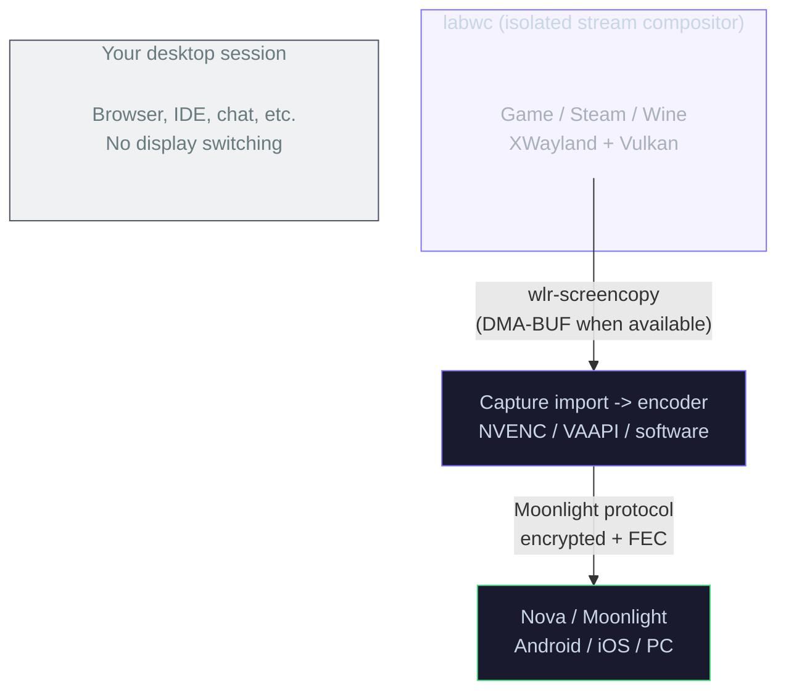

# Runtime and Streaming Model

Polaris is built around a stream runtime that is separate from your normal desktop session. The default Linux recommendation is Headless Stream: games launch inside a private `labwc` Wayland compositor, Polaris captures that compositor, and your KDE, GNOME, or wlroots desktop keeps its layout and display state.

Use this page when you want the technical model behind the README, runtime dashboard, troubleshooting logs, or launch behavior.

## Stream Runtime

Headless Stream is controlled by these settings:

```ini
# Preferred first-class mode (Private Stream family uses labwc today)
linux_stream_mode = headless_stream
linux_private_runtime = labwc
linux_prefer_gpu_native_capture = enabled

# Legacy booleans (still accepted; written together when the UI/API changes mode)
headless_mode = enabled
linux_use_cage_compositor = enabled
```

| `linux_stream_mode` | Meaning |
|---|---|
| `headless_stream` | Private Stream — private labwc compositor, prefer true headless |
| `windowed_stream` | Private Stream (GPU-native preference) — may window labwc to keep DMA-BUF |
| `host_virtual_display` | Host-side virtual output (EVDI / wlr / kscreen) |
| `desktop_display` | Mirror the current desktop session |
| `gamescope_stream` | Gamescope Stream — attach idle `gamescope-0` or spawn owned headless; portal/PipeWire capture (available when `gamescope` is on PATH) |
| `headless_dongle` | Swap desktop onto a dummy-plug connector for KMS capture (needs streaming + primary outputs) |
| `family_isolated` / `headless_evdi` | Reserved slots for community Family Mode + EVDI-as-primary |

Picking a mode by setup, in plain language, is covered in [Launch modes and capture paths](launch-modes.md); this page is the technical model behind it.

- `linux_stream_mode` is the source of truth when set; otherwise Polaris derives the mode from the legacy booleans.
- `linux_private_runtime` selects the nested compositor for private modes (`labwc` or `gamescope`).
- `linux_prefer_gpu_native_capture = enabled` asks Polaris to prefer DMA-BUF/GPU-resident capture where the driver stack is proven safe (see [Capture and Encode](#capture-and-encode) for how that is gated today). If a compositor or driver cannot provide it, Polaris should report the real SHM/system-memory fallback instead of pretending the stream is GPU-native.
- Capture (wlroots screencopy, portal, KMS) stays orthogonal to which private runtime owns the session.

See [Stream paths (plugin contract)](stream-paths.md) for how to add a new mode (runtime × capture × topology) without more boolean soup.

The private runtime is intentionally isolated. Steam, Wine, XWayland clients, and game launches should stay inside the stream compositor instead of bouncing back to the host desktop.


```mermaid
flowchart TB
  subgraph labwc ["labwc (isolated stream compositor)"]
    game["Game / Steam / Wine\nXWayland + Vulkan"]
  end

  subgraph desktop ["Your desktop session"]
    apps["Browser, IDE, chat, etc.\nNo display switching"]
  end

  game -->|"wlr-screencopy\n(DMA-BUF when available)"| encoder
  encoder["Capture import -> encoder\nNVENC / VAAPI / software"] -->|"Moonlight protocol\nencrypted + FEC"| client
  client["Nova / Moonlight\nAndroid / iOS / PC"]

  style labwc fill:#7c73ff15,stroke:#7c73ff,color:#c8d6e5
  style desktop fill:#4c526515,stroke:#4c5265,color:#687b81
  style encoder fill:#1a1a2e,stroke:#7c73ff,color:#c8d6e5
  style client fill:#1a1a2e,stroke:#4ade80,color:#c8d6e5
  style game fill:transparent,stroke:none,color:#a8b0b8
  style apps fill:transparent,stroke:none,color:#687b81
```

## Capture and Encode

Polaris captures the active stream output, imports frames into the best available encoder path, and reports the real path in the dashboard and logs.

Important runtime fields:

| Field | What it tells you |
|---|---|
| Requested mode | What the client or app launch asked for |
| Effective mode | What Polaris actually started |
| Capture transport | The active capture path, such as DMA-BUF or SHM fallback |
| Frame residency | Whether frames stay on GPU or move through system memory |
| Frame format | The captured pixel format |
| Encoder | The active backend, such as NVENC, VAAPI, or software |

How the GPU-native DMA-BUF path is granted today: automatic DMA-BUF capture is limited to CUDA/NVENC hosts. VAAPI routes (AMD and Intel) deliberately stay on the SHM/system-memory copy path until the DMA-BUF import boundary has proof from affected hosts, because re-enabling it has previously crashed real RDNA machines (issues #367 and #409 track this). Portal/PipeWire capture applies the same vendor gate; `POLARIS_PORTAL_DMABUF=1` is an explicit, unvalidated expert opt-in for testing that boundary, and `POLARIS_PORTAL_DMABUF=0` forces the CPU path. When a GPU-native path is requested but cannot be granted, `capture.reason` reports the real fallback (for example `gpu_native_requested_shm_fallback`) rather than pretending.

Deferred headless encoder capabilities are primed before first launch negotiation so Main10 support is advertised correctly on the first real launch. On Linux, Polaris uses RealtimeKit when available so thread-priority elevation can still succeed when the user service inherits conservative limits.

## Linux LTS Headless Fallback Matrix

This matrix validates the labwc Headless Stream architecture on long-term-support distributions; it is not an Xvfb or gamescope replacement. Use Xvfb/gamescope only as investigation tools if this matrix exposes a real target environment that the current path cannot cover.

| Environment | Expected runtime | Expected capture decision | Required packages / caveats |
|---|---|---|---|
| Ubuntu 24.04 LTS | `labwc` private Wayland session, `HEADLESS-1`, `requested_headless=true`, `effective_headless=true` | Prefer `headless_extcopy_dmabuf` when wlroots/ext-image-copy and the encoder import path expose DMA-BUF; otherwise `headless_shm_fallback` is supported | Install Polaris runtime dependencies plus `labwc`, `xwayland`, `wayland-protocols`, Mesa/Vulkan drivers, PipeWire/WirePlumber, and `grim` for dashboard previews. NVIDIA high-FPS tests should use a CUDA-enabled package. |
| Debian 12 Stable | Same headless labwc session and `HEADLESS-1` routing | `headless_shm_fallback` is the conservative baseline; DMA-BUF may be unavailable on older wlroots/protocol combinations | Ensure backported/new-enough `labwc`/wlroots where possible, `xwayland`, GPU userspace drivers, PipeWire/WirePlumber, and user access to render/input devices. Treat SHM as a compatibility path, not a startup failure. |
| Ubuntu 22.04 LTS | Headless labwc can run when dependencies are available, but distro packages are older | Expect SHM/RAM fallback unless the compositor/protocol/driver stack has been updated | Older wlroots/labwc packages may miss headless-output or ext-image-copy behavior needed for DMA-BUF. Validate with logs before filing a runtime replacement issue. |
| Parent Wayland desktop with GPU-native override | Windowed private compositor under the existing desktop, not true headless | `windowed_dmabuf_override` when `linux_prefer_gpu_native_capture`/override is active and frames stay GPU-resident on the selected NVIDIA/AMD render path | Requires a working parent `WAYLAND_DISPLAY`. Use only after normal Headless Stream has been validated. |

Capture decision meanings:

- `headless_extcopy_dmabuf`: true-headless labwc capture selected DMA-BUF and frames remain GPU-resident through encoder conversion.
- `headless_shm_fallback`: true-headless labwc capture fell back to SHM/system memory. This is a supported RAM-capture fallback and can still be healthy, especially for compatibility validation.
- `gpu_native_requested_shm_fallback`: a GPU-native path was requested, but Wayland capture still produced SHM frames.
- `windowed_dmabuf_override`: Polaris intentionally used a windowed private compositor under a parent Wayland session to keep capture GPU-native.

Check `/polaris/v1/session/status`, `/polaris/v1/stream-policy`, or a support bundle for `capture.path`, `capture.reason`, `capture.reason_message`, `capture.cpu_copy`, `capture.gpu_native`, and the nested `capture.decision` / `capture_decision` object. The nested decision repeats transport, residency, frame format, selected reason, runtime backend, requested/effective headless state, and GPU-native override state so a bundle shows both what path was selected and why.

## Session Lifecycle

Polaris tracks owner and viewer roles explicitly. The owner controls the active session. Viewers can join in watch mode without taking over the running stream, and passive watch mode uses the active owner profile instead of silently renegotiating a different stream.

Steam paths are handled conservatively:

- Steam library launches use an isolated Linux Gamepad UI bootstrap and cleanup path so Steam titles stay in-stream.
- Steam-launched children that escape the direct app process group are cleaned up when the isolated stream runtime stops.
- Steam Big Picture and Steam/Proton helper paths avoid risky MangoHud injection because MangoHud can crash helper processes before a usable frame exists.
- MangoHud is isolated from the compositor and only re-injected into the game launch path when requested.

## Browser Stream

Browser Stream is experimental. It uses WebTransport and WebCodecs for browser-based streaming and exposes `/browser-stream` with `/webrtc` compatibility aliases.

Browser Stream sessions use the same isolated runtime model as normal launches. When the browser stream closes, Polaris stops the browser helper, transport, audio/video capture, isolated compositor, and launched Steam game together. Polaris also settles Steam cleanup before the next Nova or Moonlight launch so a browser test does not leave stale Steam state behind.

## HDR and Main10

Polaris separates true HDR from 10-bit SDR.

True HDR requires the active capture path to expose HDR display metadata. Today that means a KMS/DRM display path with an HDR-capable output reporting `HDR_OUTPUT_METADATA`, plus a client HDR request and a 10-bit-capable encoder. A valid true HDR session logs:

```text
HDR metadata: available=true usable=true
Color coding: HDR (Rec. 2020 + SMPTE 2084 PQ)
HDR decision: ... display_hdr=true hdr_metadata_available=true stream_hdr_enabled=true
```

If the log says `HDR metadata: available=true usable=false`, Polaris found an HDR metadata blob but the static metadata is incomplete. Polaris treats that stream as SDR instead of tagging it as HDR with unusable metadata.

Headless labwc/wlroots sessions are treated as SDR until the headless display path can truthfully provide HDR metadata. In that mode, a client can still request a 10-bit HEVC/Main10 or P010 encode path for SDR, but Polaris will not advertise true HDR without metadata.

## Useful Log Markers

These lines are good first checks when validating a stream:

```text
session_optimization: requested=... selected=...
session_runtime: backend=labwc requested_headless=true effective_headless=true
wlr: capture_transport=... frame_residency=... frame_format=...
Creating encoder [...]
session_pacing: policy=... target_fps=...
```

For capture fallbacks, audio routing, Bazzite-specific validation, and recovery commands, see [Troubleshooting](troubleshooting.md) and the [Bazzite guide](bazzite.md).
